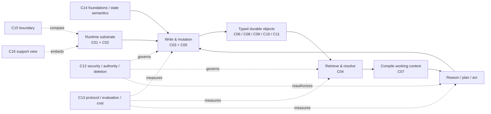

# Agent Memory 字段树：五根、十四个主簇、两个边界视图

截至 2026-08-10，最终可回放输入包含 4,407 个 identifier-level entities；两波 breadth screening/reconciliation 形成 1,899 项 canonical map；归并 direct evidence provenance 后，ledger 中共有 1,994 个 mapped/deep-verified 对象，其中 989 papers、954 repositories，rolling 12 months 1,659、rolling 90 days 924、future metadata promoted 0。字段图由 mapped corpus 而非 deep shortlist 生成；所有 mapped entity 至少有一个 canonical membership，deep evidence 只负责验证判断，不反向定义字段边界。

<!-- process:method -->

## 1. Canonical DAG

下图的实线只表示 taxonomy parent，不表示运行时调用、历史影响或因果。C12/C13 在实现中横切多个簇，但仍按 canonical parents 画入；C15/C16 用虚线样式表示 boundary/support。

```mermaid
flowchart TB
    R1["MM-R1 State, Representation & Access"]
    R2["MM-R2 Memory Dynamics & Learning"]
    R3["MM-R3 Scope, Subject & World"]
    R4["MM-R4 Systems, Runtime & Interchange"]
    R5["MM-R5 Assurance, Governance & Economics"]

    C01["C01 Services & Control Planes"]
    C02["C02 Storage & Indexing"]
    C03["C03 Structured / Relational / Temporal"]
    C04["C04 Retrieval / Ranking / Navigation"]
    C05["C05 Lifecycle / Consolidation / Forgetting"]
    C06["C06 Experience / Procedures / Skills"]
    C07["C07 Working Context / Compression / Cost"]
    C08["C08 Personalization / Identity / Continuity"]
    C09["C09 Coding / Project / Environment"]
    C10["C10 Embodied / Multimodal / World State"]
    C11["C11 Shared / Distributed / Portable"]
    C12["C12 Security / Privacy / Integrity / Governance"]
    C13["C13 Evaluation / Benchmarks / Comparability"]
    C14["C14 Foundations / Theory / Taxonomies"]
    C15["C15 Model-Native / Parametric Boundary"]
    C16["C16 Application / Framework Support View"]

    R1 --> C01 & C02 & C03 & C04 & C07 & C10 & C13 & C14 & C15
    R2 --> C04 & C05 & C06 & C07 & C08 & C12 & C13 & C14 & C15
    R3 --> C03 & C06 & C08 & C09 & C10 & C11 & C13 & C14 & C16
    R4 --> C01 & C02 & C09 & C11 & C16
    R5 --> C05 & C07 & C08 & C11 & C12 & C13

    classDef root fill:#17324d,color:#fff,stroke:#17324d;
    classDef important fill:#e8f2ff,color:#10253b,stroke:#356da3;
    classDef boundary fill:#fff6dc,color:#513c00,stroke:#aa7c00,stroke-dasharray: 5 4;
    class R1,R2,R3,R4,R5 root;
    class C01,C02,C03,C04,C05,C06,C07,C08,C09,C10,C11,C12,C13,C14 important;
    class C15,C16 boundary;
```

## 2. 为什么是 DAG，而不是一棵项目目录树

五个 root 分别回答五类正交问题：状态怎样存在和被访问；状态怎样演化；状态属于谁或哪个世界；系统怎样运行和交换；价值、风险与成本怎样被验证。一个机制往往同时回答多类问题，例如 C07 同时属于表示/访问、动态演化与经济性；C11 同时属于主体范围、系统互操作与治理。强行选单一 parent 会把真正的架构约束藏掉。

更重要的是，字段边界按**状态语义和控制问题**划分，而不是按存储品牌、论文名称或应用目录划分：

- C02 是耐久/索引/事务 substrate；C03 是关系、时间、版本和冲突的表示语义。图数据库可同时实现两者，但两者不能互相替代。
- C04 决定“取什么”；C07 决定“有限上下文中保留多少、如何压缩”；C05 决定“状态如何产生、改变和消失”。把三者折成 retrieval 会无法审计 stale state、压缩损失和删除语义。
- C06/C08/C09/C10/C11 不是五种数据库，而是五种不同 durable object 与 authority boundary：procedure、identity/profile、project state、world state、shared state。
- C12 与 C13 分别是 assurance 和 measurement 横切面；任何“主功能”都不能在最后才外挂它们。
- C14 解释术语、历史和理论边界；C15/C16 仅防止把 model-native state 或应用 feature list 错当成 external-memory 主架构。

## 3. Broad mapped coverage

`All` 是 primary + secondary membership 的去重实体数；同一实体可跨簇，故下表不可纵向求和。Recent 指实体进入冻结 rolling window，不代表 deep verification 或趋势加速。

| Cluster | Primary | All | Paper | Repo | 12m | 90d | 字段边界（压缩版） |
|---|---:|---:|---:|---:|---:|---:|---|
| C01 Memory Services & Control Planes | 249 | 372 | 132 | 233 | 308 | 161 | 跨 session memory service/API/runtime/control plane；排除 feature-list-only 框架和通用 DB。 |
| C02 Agent-Memory Storage & Indexing | 49 | 107 | 31 | 70 | 89 | 25 | Agent-memory workload 的 durable/index/transaction substrate；排除 generic vector DB/RAG。 |
| C03 Structured, Relational & Temporal | 148 | 379 | 231 | 143 | 318 | 203 | 显式保存 relation/time/source/version/conflict；排除 flat similarity-only retrieval。 |
| C04 Retrieval, Ranking & Navigation | 49 | 192 | 148 | 44 | 175 | 87 | 决定何时、从哪里、以何预算选择长期状态；排除无 lifecycle 的 generic RAG。 |
| C05 Lifecycle, Consolidation & Forgetting | 143 | 479 | 348 | 130 | 406 | 237 | write/admit/update/consolidate/dedup/forget/revoke/rollback。 |
| C06 Experience, Procedural Memory & Skills | 138 | 345 | 297 | 48 | 298 | 196 | trajectory/feedback/failure → reusable procedure/skill；排除即时 reflection。 |
| C07 Working Context, Compression & Cost | 55 | 187 | 148 | 36 | 155 | 76 | semantic context selection/compression/virtualization；排除纯 KV/serving 优化。 |
| C08 Personalization, Identity & Continuity | 99 | 248 | 220 | 28 | 205 | 120 | 可更新、可纠正、影响后续行为的 user/persona/self state。 |
| C09 Coding, Project & Environment | 307 | 368 | 13 | 352 | 352 | 218 | repo/decision/constraint/handoff/session/environment state；排除 generic coding harness。 |
| C10 Embodied, Multimodal & World State | 128 | 288 | 265 | 23 | 212 | 160 | 在部分可观测长时域中持续保存并修正世界状态。 |
| C11 Shared, Distributed & Portable | 160 | 297 | 151 | 127 | 243 | 130 | 跨 agent/team/tenant 的 scope、sync/merge、schema、ACL、interchange。 |
| C12 Security, Privacy, Integrity & Governance | 174 | 285 | 225 | 57 | 262 | 151 | memory-specific write/传播/read/delete 的攻击、防御、权限、来源和修复。 |
| C13 Evaluation, Benchmarks & Comparability | 174 | 422 | 373 | 45 | 375 | 235 | 能隔离 memory 作用的 longitudinal/intervention/use-based protocol。 |
| C14 Foundations, Theory & Taxonomies | 37 | 93 | 89 | 4 | 69 | 45 | Agent Memory definition、formal/cognitive/OS abstraction；排除无 Agent bridge 的类比。 |
| C15 Model-Native / Parametric Boundary | 25 | 44 | 36 | 8 | 35 | 28 | 仅保留有 cross-run/experience/external-memory bridge 的 latent/parametric state。 |
| C16 Application/Framework Support View | 59 | 124 | 70 | 54 | 99 | 31 | 仅观察有清晰 memory-specific integration 的应用/框架。 |

覆盖结构显示三个事实，但不等于质量排名：C05/C03/C13 的 all-membership 最大，说明 broad corpus 把 lifecycle、structured state 与 evaluation 当作大量工作之间的桥面；C09 是纯 repository-led 的显著工程簇；C10/C06/C13 的 rolling-90-day paper 密度高，说明世界状态、经验复用和评测仍快速分化。是否“成熟”必须由 deep evidence、运行真值和独立复现另判。

## 4. 从 taxonomy 到运行时架构的投影

以下是用于阅读的功能投影，不是第二套 taxonomy：

这个投影的核心是把模型从“数据库的任意客户端”降为有边界的 planner/reader：write admission、版本解析、权限、恢复和物理删除不应只靠回答模型自觉完成。MemTxn 的外部事务边界、bitemporal identity/version 分离、Collaborative Memory 的 time-varying policy 和安全包的 write→store→retrieve→act 威胁链分别支持这一分层；但它们尚未构成一个被独立复现的统一标准。（代表性 deep IDs：`FND-C17/FND-EV32–33`、`REP-C02/REP-V03–04`、`EXP-C06/EXP-V11–12`、`OPS-C07/OPS-J07`、`OPS-C27/OPS-J27–45`。）

<!-- synthesis:FT-AUTO-01 claims:EXP-C06,FND-C17,OPS-C07,OPS-C27,REP-C02 clusters:MM-C01,MM-C03,MM-C05,MM-C12,MM-C13,MM-C14 -->

## 5. Bridge 关系与不可误读之处

Canonical parent 之外，运行时常见 bridge 是：C01↔C02/C05/C11；C03↔C02/C04/C05/C10；C04↔C05/C07/C12；C05↔C06/C12；C06↔C09/C10/C11；C08↔C03/C05/C12/C13；C09↔C03/C05/C06/C12；C11↔C01/C05/C12。C12 横切 C01–C11，C13 横切所有主簇，C14 是解释层。

这些 bridge 表示必须共同设计或共同评测，不表示一个簇“包含”另一个簇。例如 graph representation 不自动带来 trustworthy retrieval；共享 store 不自动带来 organizational authority；压缩节省 token 也不自动保持 action-relevant evidence。独立 LightMem 复现和 STALE 反例分别表明 retriever/budget、更新后的行为适应可以反转表面结论。（`REP-C05/REP-V09–10`、`REP-C06/REP-V11–12`、`EXP-C13/EXP-V25–26`。）

<!-- synthesis:FT-AUTO-02 claims:EXP-C13,REP-C05,REP-C06 clusters:MM-C01,MM-C03,MM-C05,MM-C12,MM-C13,MM-C14 -->

## 6. 字段级成熟度读法

- **结构共识较强，产品保证较弱**：typed state、scope/time/provenance、read/write/control 分工已在多个独立机制与工程实现中反复出现；但仓库大多仅文档/工件可见，未执行，也没有跨产品 deletion/tenant/adoption 证据。
- **当前主要变化发生在 control，而非单纯 storage**：learned operation policy、transactional update/recovery、budget-aware consolidation、mutation-plane forgetting、active navigation 都把“该做哪种 memory operation”变成一等决策。（`FND-C14/FND-EV26–27`、`FND-C17/FND-EV32–33`、`FND-C19/FND-EV36–37`、`FND-C21/FND-EV40–41`。）
- **评测正在从 recall 向 use、mutation 和 failure 扩展**：固定历史 QA 仍必要，但无法替代 incremental update、tool grounding、interactive action、multi-party、multimodal、implicit/procedural 与 write→execute→forget security protocol。（`BEN-C03/BEN-EV05–06`、`BEN-C07/BEN-EV13–14`、`BEN-C12/BEN-EV23–24`、`BEN-C16/BEN-EV31–32`。）

因此，字段树用于回答“大家在做什么、边界在哪里”；任何采购、实现或性能选择必须继续进入对应 cluster brief、reference architecture 和 protocol-matched deep evidence。

<!-- synthesis:FT-AUTO-03 claims:BEN-C03,BEN-C07,BEN-C12,BEN-C16,FND-C14,FND-C17,FND-C19,FND-C21 clusters:MM-C01,MM-C03,MM-C05,MM-C12,MM-C13,MM-C14 -->
