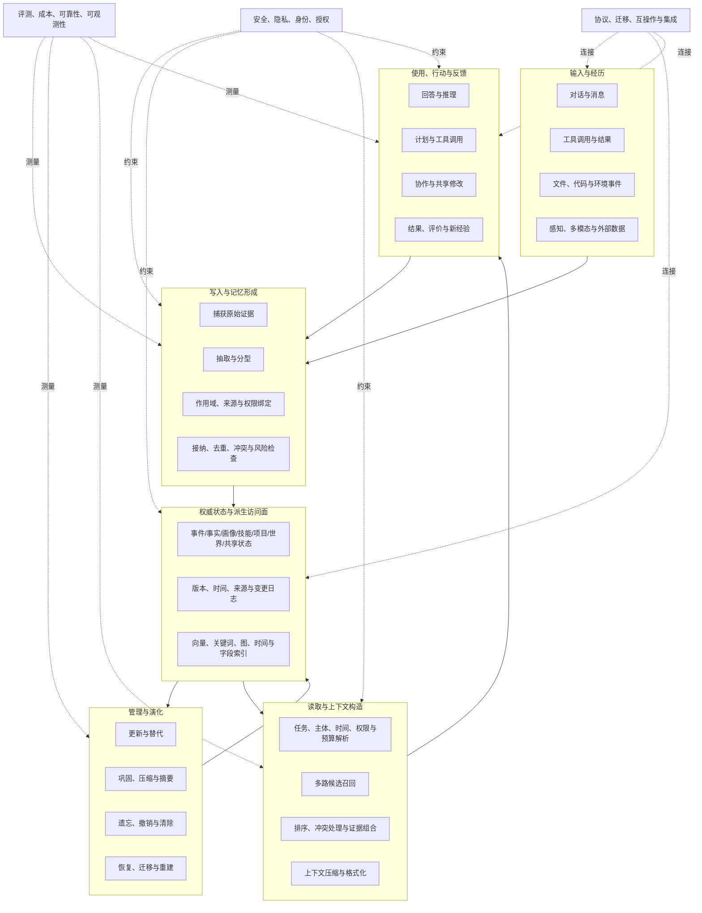

# Agent Memory 通用架构模型：系统究竟由哪些部分组成

**证据截止：2026-08-10**

这是一张描述性架构模型，不是推荐架构。它把当前论文、产品和 GitHub 实现中反复出现的责任拆开，帮助读者看清：不同系统省略了什么、替换了什么，以及局部机制为何会影响整个 Memory 生命周期。

## 1. 总体结构

这张图刻意把“权威状态”和“派生索引”分开。向量、关键词摘要和图边常常是为了访问而生成的投影，不一定是事实本身。若两者混为一体，索引重建、删除传播、来源核查和版本回退都会变得含糊。

## 2. 输入层：Memory 从哪里获得状态

输入并不只有用户发言。Agent 还会接触工具输出、网页、文件、代码、构建日志、其他 Agent 消息，以及现实或模拟环境中的观察。不同来源具有不同可信度和时效性。

当前较完整的实现通常会保留四类元信息：

- **谁产生的**：用户、Agent、工具、外部服务或其他主体；
- **在什么范围内有效**：用户、会话、项目、仓库、团队、租户或世界；
- **何时观察到、何时有效**：观察时间和事实有效时间可能不同；
- **它是什么性质**：原始证据、模型推断、外部声明还是行动结果。

许多错误不是因为检索算法不够强，而是这些信息在写入前已经丢失，后续无法判断某条内容属于谁、是否过期或能否用于当前行动。

## 3. 写入层：从经历到长期状态

写入可以被理解为四步。

### 3.1 捕获原始证据

系统先保存或引用原始事件，例如一段对话、一次工具结果、文件差异或环境观察。原始证据为之后重新抽取、纠错和审计保留依据。并非所有系统都长期保存全文；有些只保留窗口或外部引用，但“能否回到来源”仍是一条重要边界。

### 3.2 抽取与分型

模型或规则从原始输入中生成记忆候选。候选可能是事实、事件、偏好、任务、关系、技能或状态变更。分型影响后续操作：偏好可以被用户纠正，项目决策关联代码版本，技能需要适用条件，而世界状态可能随新观察失效。

### 3.3 绑定范围、来源和权限

同一句内容在不同主体和用途下含义不同。“用户喜欢简洁回答”不会自动成为团队共享规则；一个项目中的构建失败也不会传播到另一个分支。当前带作用域的实现通常在写入时绑定边界，而不是等到召回后再让模型猜测。

### 3.4 接纳与提交

系统决定候选是否值得长期保留，并处理重复、矛盾、隐私和潜在污染。轻量实现可能直接写入；更复杂的系统会把候选放入待确认区、追加版本日志，或把不可逆修改交给单独控制面。

不同写入路线的深入比较见[写入与记忆形成](mechanisms/02-write-and-formation.md)。

## 4. 状态层：保存的不只是文本

### 权威状态

权威状态回答“系统目前认为存在什么”。它可以是关系表、文档、事件日志、图节点、版本化对象或文件。关键不是存储品牌，而是能否表达记忆对象所需的身份、时间、来源、版本和作用域。

### 派生访问面

为了快速找到状态，系统会建立 embeddings、全文索引、实体边、时间索引、摘要和缓存。这些结构可能异步更新，也可能在模型或索引版本变化时重建。因此它们更像物化视图，而不是不可替代的唯一真相。

### 常见状态组织方式

| 组织方式 | 权威对象通常是什么 | 访问面 | 主要复杂性 |
|---|---|---|---|
| 文本记录 | 文本/元数据行 | 向量或全文索引 | 结构简单，更新与冲突语义弱 |
| 关系/事件记录 | 表、事件或版本行 | 字段、时间、向量索引 | schema 与迁移成本 |
| 图记忆 | 节点、边和事件 | 图遍历、社区、PPR 或混合检索 | 建图、重复实体和持续维护 |
| 分层文件/对象 | 文件、目录、对象与摘要 | 路径、关键词、向量、层级加载 | 版本、同步和跨主机一致性 |
| 多后端组合 | 日志/数据库为权威，其他为投影 | 多路召回与融合 | 能力漂移、事务和恢复边界 |

详见[表示、存储与索引](mechanisms/03-representation-storage-indexing.md)。

## 5. 管理层：记忆怎样改变和消失

持久状态必须处理现实变化。管理层的主要操作包括：

- **更新与替代**：新事实是否覆盖旧事实，还是保留两者及有效期；
- **巩固与压缩**：把多条经历汇总成稳定事实、画像或技能；
- **冲突处理**：不同来源、主体或时间的内容不一致时如何保存与呈现；
- **遗忘与删除**：降低权重、停止召回、逻辑撤销和物理清除并非同一操作；
- **恢复与重建**：模型、索引、schema 或策略变化后，怎样回到历史状态并重新生成派生结构。

静态规则容易解释，但未必适应不同任务和预算；学习型控制器能动态选择操作，却可能把策略错误变成持久状态。当前大多数证据仍支持“多种操作按条件组合”，而不是一个统一最优管理策略。详见[生命周期与演化](mechanisms/04-lifecycle-and-evolution.md)。

## 6. 读取层：从候选搜索到证据包

读取通常经历四个阶段。

1. **约束解析**：确定当前用户、项目、任务、时间点、权限和上下文预算；
2. **候选生成**：通过语义、关键词、字段、图和时间路径找到可能相关的内容；
3. **排序与冲突处理**：综合相关性、新鲜度、来源、版本、风险和成本，保留必要的反方或历史项；
4. **上下文构造**：在 token 限制内选择、压缩和格式化，告诉模型内容来自哪里、为何此时有效。

这解释了为何“检索准确率”只是 Memory 质量的一部分。候选可能相关却越权，可能新但缺少来源，也可能压缩后失去决定行动的细节。详见[检索与上下文构造](mechanisms/05-retrieval-and-context.md)。

## 7. 使用层：记忆如何影响行为

Memory 的输出可能用于：

- 补充回答所需的事实或过去事件；
- 调整表达方式和用户偏好；
- 约束计划、代码修改或项目决策；
- 提供工具参数、程序步骤和可执行技能；
- 同步多个 Agent 的任务与共享状态；
- 维护世界模型并支持连续行动。

使用层需要重新检查当前条件。历史记录中保存的权限、工具版本或环境假设不应自动继承到当前行动。程序性记忆尤其如此：它可能帮助 Agent 更快完成任务，也可能放大错误经验或过期流程。详见[使用、反馈与技能学习](mechanisms/06-use-feedback-and-skills.md)。

## 8. 反馈环：系统怎样从结果继续学习

行动结果会再次成为输入。系统可以记录成功/失败、用户纠正、测试结果、奖励或环境变化，再决定是否更新事实、调整画像、修改技能或创建新版本。

反馈环将 Memory 与普通历史存储区分开来，但也带来错误自我强化问题。如果系统把自身失败解释成正确经验，后续检索会提高错误路径的可见性；如果只记录成功，又可能忽略条件变化和幸存者偏差。因此近期工作开始关注经验晋升、错误传播和持续评测，而不只是更长的保留时间。

## 9. 横切面为什么必须贯穿架构

### 安全、隐私和身份

攻击可能发生在输入、持久化内容、查询触发和最终工具行动中的任意位置。权限也会随主体、时间和用途变化。在当前风险模型中，安全不是一个写入过滤器，而是每次状态转移都会遇到的约束。详见[安全、隐私与治理](cross-cutting/02-security-privacy-governance.md)。

### 评测

写入正确、检索命中、回答正确和行动成功是不同指标。一个系统可能召回正确记录，却在上下文压缩或工具参数阶段失败。详见[评测与 Benchmark](cross-cutting/01-evaluation-and-benchmarks.md)。

### 成本、可靠性与可观测性

管理和派生索引会持续消耗模型调用、存储、重建和审核成本；异步投影、迁移和删除传播也会产生暂时不一致。没有写入、读取和行动轨迹，就很难知道失败发生在哪一层。详见[成本、可靠性与可观测性](cross-cutting/03-cost-reliability-observability.md)。

### 互操作与集成

Memory 需要连接 Agent runtime、模型、工具、数据库、文件系统和权限系统。当前协议和项目规范覆盖的层次不同：有的定义服务 API，有的定义记录格式，有的只处理上下文或异步任务生命周期。它们不能仅因名称相近而视为同类标准。详见[互操作与集成](cross-cutting/04-interoperability-and-integration.md)。

## 10. 四种常见架构形状

这些形状描述公开系统中常见的组合，不表示优先顺序。

| 架构形状 | 主要结构 | 常见场景 | 典型边界 |
|---|---|---|---|
| 轻量外部记忆 | 文本/元数据 + 向量或全文索引 | 长期对话、简单助手 | 生命周期、冲突和权限通常较薄 |
| 分层上下文系统 | 热上下文 + 持久层 + 摘要/分页/文件层级 | 长任务、Coding Agent | 压缩损失和层间一致性 |
| 结构化状态系统 | 事件/事实/画像/关系/时间版本 + 多索引 | 更新频繁、关系和历史问题 | schema、迁移、建图和维护成本 |
| Memory 服务/控制面 | 独立 API/runtime + 多后端 + 管理策略 + 治理 | 多 Agent、跨应用或团队共享 | 身份、协议、能力漂移与运维复杂性 |

现实项目经常混合这些形状。例如，一个服务可能用关系数据库保存版本化记录，用向量索引召回，用图表达实体关系，再由独立控制器处理写入和遗忘。理解具体项目时，应检查真实组件和数据流，而不是只根据“graph memory”“memory OS”等标签分类。相关实例见[GitHub 候选雷达](github-radar.md)和[重点项目报告](projects/)。

## 11. 当前架构成熟度

相对成熟的是持久存储、向量/关键词访问、基本用户/会话作用域，以及通过 SDK 或服务把 Memory 接入 Agent。正在形成共同工程语言的是多路检索、对象分型、来源和时间元数据、生命周期操作、上下文预算及更细的评测协议。

仍处于较早阶段的包括：跨后端一致的版本和删除语义、能够安全操作不可逆状态的学习型控制器、可验证的跨系统记忆互操作、共享技能与记忆的动态权限、以及覆盖写入到行动的统一长期评测。

这种成熟度判断描述当前公开证据的状态，不构成系统选择建议。各分支的证据和争议在相应专题中展开。
