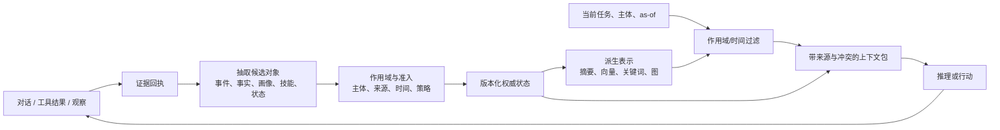

# 记忆对象与作用域：先回答“记的是什么、属于谁”

> 本文面向已了解 Agent 与 LLM 的读者。它讨论跨会话、可更新、会影响后续推理或行动的外部 Memory；一次请求内的上下文、普通 RAG 文档库和模型参数本身只作为边界参照。证据与旧分类可回溯到 [v09 的基础分类报告](../../../agent-memory-v09/bundle/clusters/mm-c14-foundations-theory-taxonomies.md)、[结构化状态报告](../../../agent-memory-v09/bundle/clusters/mm-c03-structured-relational-temporal-memory.md) 和 [共享状态报告](../../../agent-memory-v09/bundle/clusters/mm-c11-shared-distributed-portable-memory.md)。

## 从一个看似简单的偏好开始

设想一个助手在上周记下“用户不吃花生”，今天又读到“用户对花生不过敏，只是不喜欢花生酱”。如果系统把两句话都当成无主的文本块，语义检索或许能找回它们，却很难回答四个更关键的问题：这是不是同一个人？哪句话描述的是事实、偏好还是一次偶发经历？第二句话是否修正了第一句话？这条信息可不可以被另一个 Agent、另一个团队或一个外部工具使用？

这就是 Agent Memory 的对象问题。记忆不是“一段可嵌入的文本”，而是带有行为语义的持久状态。对象类型决定写入时该抽取什么，更新时是否允许覆盖，读取时应带上哪些条件，以及它能否影响行动。作用域则决定状态属于谁、可被谁看见，以及过期或撤销如何传播。

当前较稳定的看法并不是一套唯一分类法，而是用三个正交维度描述状态：**对象**（保存的内容及其行为语义）、**操作**（它如何形成、变化和消失）、**控制信息**（主体、时间、来源、版本、权限和预算）。[MemoryBank](https://arxiv.org/abs/2305.10250) 已将存储、检索和更新分开，并同时处理对话、事件摘要与人格评估；[MemTxn](https://arxiv.org/abs/2607.27834) 则把来源支持、时间版本和恢复日志放到回答模型之外。它们并未证明全行业已有统一标准，但共同说明：对象、操作和控制信息不能再由一个 `text + embedding` 字段代替。

## 方案空间：对象不是按数据库品牌划分

下表是读者理解当前系统的一个实用谱系。一个系统可以同时拥有多类对象；它们不应被理解为彼此竞争的“产品类型”。

| 对象家族 | 保存什么 | 为什么不只是文本块 | 常见读取方式 | 主要风险与成熟度 |
|---|---|---|---|---|
| 事件与原始证据 | 对话轮次、工具输出、环境观察、导入回执 | 是其他摘要、事实和技能的可追溯依据 | 按时间、任务、来源定位 | 容量与隐私负担高；作为证据底座较成熟 |
| 事实、画像与信念 | 稳定事实、用户偏好、主体属性、带置信度的判断 | 需要主体、有效时间、来源和纠正语义 | 当前事实、历史事实或有冲突的事实 | 过时、臆测被写成事实、跨主体泄露；工程常见但治理不完整 |
| 关系、实体与世界/项目状态 | 人物、实体、依赖、空间关系、代码库决策和环境状态 | 查询常需要多跳关系、版本或“当时的状态” | 实体导航、图遍历、时间解析 | 建模和维护昂贵；在关系密集任务中处于早期到中期成熟度 |
| 程序、反思与技能 | 指令、脚本、工具序列、失败经验、可执行技能 | 它不是“关于用户的事实”，而是未来行动的候选方法 | 按任务、前置条件、工具版本匹配 | 旧工具假设、错误迁移、危险执行；研究活跃、工程保证较弱 |
| 共享与组织状态 | 团队知识、任务交接、跨 Agent 约定 | 关键是共享边界、角色、合并和撤销，不是更大的 profile | 按角色、任务和共享策略解析 | 权限坍塌、冲突传播、租户泄露；协议与互操作仍早期 |
| 控制元数据 | 来源、主体、版本、保留期、策略、索引版本、回滚点 | 它决定内容是否可用、可审计和可恢复 | 与任一对象一同传递 | 常被遗漏；职责层面已形成较强共识 |

这里的“事实”也不等于客观真理。它更准确地说是某个来源、某个主体、某段有效时间内可被系统引用的陈述。把 `observed`（直接观察到）、`asserted`（某人声称）、`inferred`（模型推断）分开，能避免把一次猜测写成永久画像。对世界状态和项目状态，观察位置、分支、提交版本、可见性及不确定性同样是内容的一部分，而非可选标签。

## 一条对象如何走过系统

对象分类只有进入数据流才有用。下图描述的是常见解剖结构，而不是推荐架构：不同系统可能合并、替换或省略其中模块。

关键分界在于：原始证据、权威对象和派生表示不是同一层。一次工具调用可以留下事件回执；抽取器可能从中提出“用户偏好”“项目决策”或“可复用步骤”；这些候选经过范围、冲突和来源检查后成为可版本化状态。摘要、embedding 与图边则是为了访问而生成的投影。投影失效或索引重建不应改变“当时到底记录了什么”。

[AtomMem](https://arxiv.org/abs/2606.19847) 的原子事实、事件/画像层和关联图，是这种分层的近期代表；[A-MEM](https://arxiv.org/abs/2502.12110) 则把结构化笔记、历史链接和记忆演化放入写入过程。二者都说明写入会改变周围表示，但都不足以证明任意对象模式优于简单记录。对象越丰富，抽取误差、迁移和解释成本也越高。

## 作用域：谁的记忆，什么时候有效

“作用域”常被缩写为 `user_id`，但在实际 Agent 中至少有五个独立问题：主体是谁、可见范围多大、用途是否允许、何时成立、哪个版本可用。可将它们理解为一张随对象同行的身份证：

| 维度 | 需要表达的含义 | 典型错误 |
|---|---|---|
| 主体与租户 | 此状态属于用户、Agent、项目、团队还是组织 | 把单用户偏好当作全局事实 |
| 可见性与用途 | 可读、可写、可分享、可导出、可用于行动的范围 | 检索后才让模型“自觉忽略”越权内容 |
| 有效时间与记录时间 | 事实在现实中何时成立，以及系统何时得知 | 用最新记录回答历史问题，或把延迟导入当实时观察 |
| 版本与冲突 | 何者替代何者，是否仍存在未决冲突 | 静默覆盖，失去旧版本和纠正原因 |
| 来源与保留 | 谁或什么产生，能保存多久，删除影响哪些派生物 | 删除正文却遗留摘要、向量、缓存或工具痕迹 |

双时间（有效时间与记录时间）是解决“那时知道什么”和“现在认为何时成立”混淆的一种明确模型。[一项图原生双时间存储研究](https://arxiv.org/abs/2607.26520) 用不可变身份、版本节点和两类时间来表达此事；其价值主要在语义清晰，而非已经证明图数据库在所有任务上更好。对于变化快的世界或项目状态，这类区分尤其有意义；对于一次性、只读的问答，它可能只增加负担。

共享状态把作用域进一步推向动态权限和合并语义。v09 收录的 [Collaborative Memory 证据](../../../agent-memory-v09/bundle/clusters/mm-c11-shared-distributed-portable-memory.md) 将私有片段与选择性共享片段区分开，并要求来源与随时间变化的读写策略。一个“多人可访问的向量库”因此不自动成为组织记忆：它仍可能没有撤销、冲突、共享目的或责任归属。

## 真实实现能看见什么

开源项目提供的是实现形状，不是成熟度排行榜。固定版本的 [MemMachine](https://github.com/MemMachine/MemMachine) 文档把 episodic graph、SQL profile 与 working memory 分开；[Mem0](https://github.com/mem0ai/mem0) 公开了语义、BM25、实体和时间相关的检索面；[Cognee](https://github.com/topoteretes/cognee) 展示知识图、向量与图推理的组合。这些代码和文档足以说明“多对象、多表示”是现实工程模式，却不能单独证明隔离、删除、性能或生产采用。

不同项目的共同难题不是缺少一个新的对象名，而是语义能否穿透所有层：profile 的主体与纠正信息，能否随摘要、embedding、缓存和最终提示一起传递？技能的适用工具版本，能否在行动时再次核验？共享事实的撤销，能否使派生索引和下游 Agent 停止使用？这些问题把对象建模与生命周期、检索、安全和评测直接连在一起。

## 当前主流、近期变化与证据强弱

当前主流已从“把会话切块后向量检索”扩展为至少区分事件、语义/画像、过程性经验和控制元数据；存储、检索、更新的职责分离也较常见。过去十二个月的实质变化集中在三处：原子化与关系化的对象构造、带版本/有效时间的状态表达，以及把记忆操作本身当作受控动作。近 90 天内，MemTxn、双时间图存储与围绕控制面的工作是强信号，但大多仍是作者预印本或静态工程检查，尚未形成跨后端的统一对象协议。

成熟度应拆开看：对象与控制信息的职责分层可视为较成熟的架构共识；profile、事件和混合访问已在工程中常见；双时间、可移植共享语义和自动化的对象演化仍是中早期。没有足够的同任务、同预算、跨实现对照来证明“对象越结构化越好”，也没有公开证据证明任何现有接口已完整处理版本、撤销、物理删除与行动影响。

## 共识、争议与未解问题

**共识较强。** 跨会话、可变且会影响行动的 Memory 需要把对象语义与来源、主体、时间、版本分开保存；工作上下文不应成为唯一事实副本；过程性经验不应与用户事实使用同一套更新和授权语义。

**仍有争议。** 图、双时间或原子事实是否带来稳定净收益，取决于任务、检索器、token 预算、数据质量和维护成本。独立的 [LightMem 复现](https://arxiv.org/abs/2607.29104) 表明，在固定存储下，仅改变检索器和候选深度就可能反转表面优势；它反驳的是无条件优越性，而不是对象/版本语义本身的必要性。

**尚未解决。** 首先，缺少可以把 taxonomy 映射到真实 schema、操作语义和一致性测试的跨实现规范，因此“同名对象”常有不同含义。其次，缺少覆盖更新、删除、索引、缓存、备份和行动链路的端到端实验，无法确认一个纠正是否真正改变了后续行为。最后，个人、团队、项目与世界状态的边界在多 Agent 系统中会相互重叠；现有证据还不足以给出可移植的统一 ontology。

这些未知会影响的不是术语选择，而是读者如何解释系统声明：一个项目若只展示 `add/search`，只能证明它保存和访问了内容；若声称处理“长期记忆”，仍需看到对象、作用域、演化和行动之间的完整语义链。
