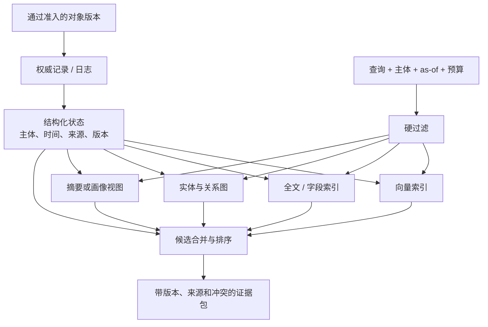

# 表示、存储与索引：把状态保存下来，不等于已经能正确使用

> **深潜阅读路径：** 本页解释底座方案全景。关系库/WAL、FTS/BM25、HNSW/IVF、混合融合、图和双时间索引的内部机制见[权威状态与索引算法](storage-indexing/01-authoritative-state-and-index-algorithms.md)；Sibyl、xerj、Causal Memory、OpenViking、Engraphis、Compartment 与 AtomicMemory 的固定版本路径见[工程 walkthrough](storage-indexing/02-engineering-walkthroughs.md)；多后端一致性、迁移、删除与恢复见[一致性与研究前沿](storage-indexing/03-consistency-recovery-and-frontier.md)。

> 本文讨论 Memory 的耐久底座和访问结构：文本/事件、关系、时间与版本如何表达，怎样落入存储，以及索引怎样从权威状态派生。它不把向量数据库、普通 RAG 或任意图数据库本身视为完整 Agent Memory。延伸证据见 [v09 存储与索引报告](../../../agent-memory-v09/bundle/clusters/mm-c02-agent-memory-storage-indexing.md)、[结构化/时间状态报告](../../../agent-memory-v09/bundle/clusters/mm-c03-structured-relational-temporal-memory.md) 和 [生命周期报告](../../../agent-memory-v09/bundle/clusters/mm-c05-lifecycle-consolidation-forgetting.md)。

## 真实问题：下一次要找的是“正确版本的正确状态”

在一次项目维护中，Agent 可能需要找到“当前生产分支使用哪种鉴权方式”；在事后审计中，它又需要回答“上个月为什么改过这项决定”。前者需要当前、被授权且未撤销的状态，后者需要历史证据、记录时间和版本链。若所有内容只是按语义相似度存成 chunk，这两类问题都可能返回措辞相近、但主体错误、时间错误或已被替代的信息。

表示、存储和索引因此分别回答不同问题：**表示**决定一个状态在语义上有哪些字段与关系；**存储**决定权威记录、版本和恢复如何持久化；**索引**决定如何快速提出候选。把三者合并为“选一个 vector store”，会遮蔽最重要的边界：embedding、摘要和图边通常是为访问服务的派生物，不应自动成为唯一事实来源。

## 方案家族与比较

| 路线 | 权威状态通常长什么样 | 索引/访问方式 | 强项 | 代价与典型失效 | 成熟度 |
|---|---|---|---|---|---|
| 追加事件与关系型记录 | 事件、对象、版本、元数据落入表或日志 | 时间、字段过滤、全文检索 | 可审计、更新和删除语义清晰 | schema 演化、复杂关联查询 | 工程基础较成熟 |
| 向量/块式表示 | 文本块或摘要及 metadata | ANN 语义近邻 | 对措辞变化鲁棒、接入简单 | 时间/主体/冲突被弱化；候选丢失或错误召回 | 工程常见，但不足以承担完整状态 |
| 混合索引 | 同一对象有词法、向量、实体、过滤字段 | 融合召回与重排 | 兼顾精确名词和语义表达 | 融合、调参与成本更复杂 | 当前实用主流之一 |
| 图与关系表示 | 实体、事件、断言、依赖和边 | 多跳遍历、传播、图排序 | 关系、路径和解释性 | 建图误差、写放大、图过期 | 条件成熟，普适优势未证实 |
| 时间/版本化表示 | 不可变身份、修订、有效/记录时间 | as-of 解析、当前/历史版本选择 | 修正、冲突和历史查询 | 状态模型与索引复杂 | 新近活跃，工程标准仍早期 |
| 多层或多后端投影 | 权威记录加 cache、向量、图、摘要、对象存储 | 按成本/时延分层访问 | 容量、速度和多任务访问 | 一致性、删除、重建与能力漂移 | 常见架构形状，端到端保证较弱 |

这些路线不是“vector 对 graph”的二选一。混合系统常让关系库或日志承担权威版本，让向量、全文和图结构分别提供候选；真正需要检查的是来源、作用域、时间和版本是否在投影到上下文时仍然存在。

## 六种底座的内部机制与数据流

### 1. 追加日志与关系型状态：先保证可恢复的事实边界

日志路线先为每次写入分配 revision/sequence，保存 payload、source、scope、time 和 operation；关系表再物化 current view、history 和对象关系。更新不是覆盖原行，而是 append revision 并改变“当前”指针。WAL、transaction 和 schema migration 解决的是原子性与恢复；全文/字段索引处理精确 ID、路径、日期和过滤。

这类底座对审计、版本和删除语义最清楚，却不会自动理解语义相似或关系依赖。`Sibyl-Memory` 的固定代码检查显示 per-tenant SQLite、JSON/FTS5 与 rebuild 逻辑是一种 local-first 形状；`scope-recall-hermes` 让 SQLite journal 作为权威，LanceDB/PGVector 成为可替换 companion。工程重点是 commit watermark：读者要知道某个索引已追到哪个 revision，而不是假设所有副本瞬时一致。

### 2. 向量/块式底座：把语义访问变成近邻搜索

向量路线将 chunk、摘要或事实映射为 embedding，写入 ANN 结构；查询也嵌入后按 cosine/dot-product/L2 找近邻。HNSW 用多层小世界图近似搜索，IVF 先选粗粒度桶，磁盘型索引则在内存和 I/O 间折中。metadata filter 可以在 ANN 前缩小集合，也可能在 ANN 后过滤；后过滤若删掉大部分 top-k，会造成“库里有，但合法候选没进入结果”的 dilution。

它适合语言改写和大规模候选生成，但 embedding 没有天然的时间、否定、主体或版本语义。更新模型或 embedding 版本后还要重嵌；删除可能只留下 tombstone；同一个 API 对不同后端的 filter、hybrid 和 consistency 能力并不相同。因而向量索引应返回 candidate + distance + index version + object revision，而不是被当作 truth store。

### 3. 混合索引：多路召回，再做可解释融合

混合路线通常并行运行 BM25/FTS、dense ANN、metadata/entity filter，有时再加 temporal decay，然后用 Reciprocal Rank Fusion、加权分数或 reranker 合并。RRF 的典型形式是 `score(d)=Σ 1/(k+rank_i(d))`，优点是不要求各路分数同量纲；学习型 reranker 能看 query-document 对，却增加模型调用和尾延迟。

`Mem0` 公开 semantic、BM25、entity 与 temporal signal，`SimpleMem` 组合 semantic、lexical、structured view，`causal-memory` 则把 RRF 与 spreading activation 结合。真正的实现问题是候选去重和 provenance：同一对象可能由三路返回，融合器要保留每一路命中、revision 和过滤条件，才能解释最终排序。混合检索已是现实工程主流，但融合权重并没有跨任务的通用答案。

### 4. 图与关系底座：通过路径而非单点相似度构造候选

图路线从原文抽取实体、事实和 typed edge，建立 passage–entity–fact 或 event–decision–outcome 网络。查询先定位 seed，再做邻居扩展、路径搜索、Personalized PageRank 或 spreading activation；PPR 可写成 `r=(1-α)s+αPᵀr`，其中 seed `s` 表达当前查询，转移矩阵 `P` 沿关系传播相关性。

[HippoRAG](https://github.com/OSU-NLP-Group/HippoRAG) 的 passage/entity/fact 多视图和 PPR 是检索型代表；`A-MEM` 的 note/link/evolution 是可变记忆代表；`causal-memory` 把 decision→outcome edge 与普通语义关系区分开。图的收益来自关系密集和多跳任务，成本来自 LLM/OpenIE 抽取、实体消歧、边更新和候选爆炸。错误高连接节点会放大污染，因此 graph 不能取代 source validation。

### 5. 时间与版本底座：把 current、history 和 late evidence 分开

版本化路线给逻辑对象稳定 ID，每次内容变化生成 revision；`valid_time` 表示现实何时成立，`transaction_time` 表示系统何时记录。查询“现在是什么”选择当前未撤销 revision；查询“当时认为是什么”按 transaction time；处理迟到证据则可以修正 valid interval 而不抹掉记录历史。

[双时间图存储](https://arxiv.org/abs/2607.26520) 将 identity/version 与两类时间显式化；[MemTxn](https://arxiv.org/abs/2607.27834) 把 temporal resolver 放进提交/读取边界；[MemState/GEM](https://arxiv.org/abs/2605.26252) 的 topic field 保存值历史，并区分 association 与会触发修订的 extension edge。最新问题已经从“有没有 timestamp”转向 interval overlap、依赖传播、并发修订和 semantic+temporal 联合索引。

### 6. 多层/多后端底座：按职责分层，而不是复制同一真相

多层系统可能同时拥有：短期 active block、耐久 SQL/document state、向量和 FTS companion、关系图、对象存储中的原始工件、缓存与 prompt projection。`MemGPT/Letta` 的 core block 与 archival memory、`MemoryOS` 的 short/mid/long tier、`MemMachine` 的 episode graph/profile SQL/working memory 都体现了放置和对象职责分离。

难点不是路由到哪个库，而是**哪一层有权威性、哪些层可重建**。若双写 SQL 和 vector 时进程中断，恢复应从 commit journal 重放索引，而不是猜哪个副本最新；若 backend 不支持 keyword search 或事务历史，统一 facade 必须暴露 capability degradation。多后端架构的最新研究议题包括 asynchronous construction 的 freshness/SLO、fleet 级索引重建、schema/embedding migration 和 derived deletion。

## 架构解剖：权威状态与可重建投影

上图的要点是两个方向：写入由权威状态向索引传播；读取先按主体、权限、时间和保留策略缩小范围，再进入不同访问路径。索引不可用时，系统应能从权威状态重建；反过来，单个 embedding 命中不应绕过时间、版本或作用域。

[MemoryOS](https://arxiv.org/abs/2506.06326) 的短、中、长期分层与 storage/updating/retrieval/generation 模块说明，多级放置与单一检索器是不同问题；[MemGPT](https://arxiv.org/abs/2310.08560) 更早将有限上下文中的换入换出看作运行时管理。近期 [MemTxn](https://arxiv.org/abs/2607.27834) 把快照日志和时间版本放在外部边界，[双时间图存储](https://arxiv.org/abs/2607.26520) 则显式区分身份、内容版本、有效时间和记录时间。它们共同支持责任分层，不能推出每个 Agent 都需要多层、图或事务系统。

## 表示决定可以问什么问题

平面 chunk 能回答“哪些历史片段和当前问题相似”；它很难自然回答“这条规则何时生效”“它由谁确认”“旧规则是否被新规则替代”“哪条边把这两个实体联系起来”。这不表示 chunk 无用。对一次性、低变化、只需语义回忆的任务，它的简单性正是优点；增加结构的价值只在关系、修订、主体隔离或可追溯性真正影响结果时体现。

原子事实和事件关系的路线试图避免“大摘要把多件事黏在一起”。[AtomMem](https://arxiv.org/abs/2606.19847) 以原子事实进入事件/画像和关联图；[Hindsight](https://arxiv.org/abs/2512.12818) 将世界、经验、实体和信念组织成不同逻辑网络。图路线并不只等于 Neo4j：它可以是关系表、边列表或可物化的导航结构。重要的是边是否有来源、时间和版本，否则图只是更难删除的摘要。

时间/版本表示解决的是“状态变化”而非检索速度。不可变身份指向一段逻辑记忆，内容修订才表示它在某时被纠正、替代或撤销。有效时间表达现实世界何时成立，记录时间表达系统何时收到了证据。二者分开后，系统才能在同一份底座上回答 current view、historical view 与 late-arriving evidence；代价是每个索引、缓存和上下文编译器都必须知道该选哪个版本。

## 真实实现中的存储形状

固定版本的工程材料显示多种实现，而非统一数据库答案。[Mem0](https://github.com/mem0ai/mem0) 公开 semantic、BM25、实体融合及时间相关的检索面，并通过不同 provider/backend 组合能力；[Cognee](https://github.com/topoteretes/cognee) 把知识图、向量嵌入和图推理并置；[MemMachine](https://github.com/MemMachine/MemMachine) 明确区分 graph episodic、SQL profile 和 working memory；[HippoRAG](https://github.com/OSU-NLP-Group/HippoRAG) 提供知识图加排序/导航的检索形状。

这些项目显示出两个共同现实：其一，多表示是工程上可行的；其二，后端能力并不恒等。某些后端支持 metadata filter、时间排序或事务历史，另一些只提供向量近邻；API 层若把它们抽象成同一个 `search`，实际隔离、删除和排序语义可能随 backend 改变。v09 对这些仓库的检查是固定版本的文档和代码表面检查，未执行仓库，因此不以此推断性能、可靠性或生产采用。

## 索引不是检索结论

索引只生成候选，最终能否正确使用还取决于范围过滤、版本解析、重排、上下文预算和模型是否采纳证据。以向量、关键词、实体、图、时间为多路入口的混合访问正在成为常见形状，因为它们分别补偿不同失配：词法检索保住精确标识符，向量处理改写，图处理路径，时间/版本筛掉不该出现的旧状态。

但多路入口也使可观测性变得必要。若回答错误，原因可能是权威状态不存在、索引未更新、硬过滤过严、候选被融合器压低、上下文预算截断，或模型忽略了已提供的证据。将候选来源、索引版本、过滤理由、排序理由和编译 token 记录下来，才能区分这些失败。没有这些记录，“图比向量好”或“后端升级改善记忆”往往只是不可归因的现象。

## 成本与一致性：被低估的部分

表示越多，写入放大越明显：同一逻辑对象可能触发 JSON/SQL 写入、embedding、全文索引、实体抽取、边更新、摘要和缓存失效。读取也不是只付一次 ANN 代价；混合召回、图遍历、重排和上下文构造会竞争延迟与 token 预算。更新/删除尤其昂贵，因为必须处理所有派生表示，而不是只删除主表的一行。

一致性不必在每层相同。来源、主体、版本父子关系、撤销和行动授权通常需要明确且可恢复的提交边界；向量、摘要、图和缓存可以存在短暂滞后，但读取结果需要知道索引版本或水位。否则系统无法区分“这是一条旧事实”与“这是一条新事实尚未投影”。这是一种描述性工程约束，不意味着所有部署都应采用同一种事务技术。

## 当前主流、近期变化与反方证据

当前工程主流是多表示而非单纯单库：关系或文档记录承载对象与元数据，向量/关键词提供快速召回，部分系统再增加实体或图导航。过去十二个月的实质变化在于从 chunk/summary 走向原子对象、关系化表示和可解析的时间/版本；近 90 天的双时间和事务性工作把“当前状态从何而来”推到架构前台。

不过，表示复杂度没有已证实的单调收益。[LightMem 的独立复现](https://arxiv.org/abs/2607.29104) 在固定存储下发现检索器和候选深度可显著改变成绩，且匹配深度时原始历史常不弱；[双时间图存储研究](https://arxiv.org/abs/2607.26520) 也只在其特定样本与协议中报告结果。结论应保持在条件层面：结构和时间语义能表达 flat retrieval 不易表达的问题，但缺少覆盖同一数据、模型、候选预算和后端的广泛独立对照，无法给出普适性能排序。

## 最新研究议程：数据库开始面对“状态轨迹”

最近一年的变化可以压缩为四个真正的技术问题。第一，**construction cost 成为一等系统指标**：LLM 抽取、embedding、建图和 consolidation 可能把绝大多数成本搬到 query 之前；[系统表征研究](https://arxiv.org/abs/2606.06448) 已开始分 construction/retrieval/generation 记录调用、token、延迟和硬件活动。第二，**正确性从 record 升到 trajectory**：记录存在不等于当前视图、依赖传播和遗忘正确，[GEM/MemState](https://arxiv.org/abs/2605.26252) 试图把 content、structure、policy 与 state-level operators 放进同一抽象。

第三，**索引需要联合语义、时间和结构**：现在常见做法是分别建 vector、temporal filter 和 graph，再在应用层拼接；新研究在问能否让 engine 原生表达 field history、typed dependency 和 semantic search。第四，**读取可能也是写入**：若一次访问会提升 salience、改变缓存或学习检索策略，read-only 数据库假设不再成立，并发、租户隔离和隐私侧信道随之出现。

这些仍是研究议程而非行业事实。MemState 是 property-graph 原型，系统表征使用特定适配和硬件，双时间结果也来自有限协议。要把方向升级为成熟能力，还需要开放的 crash/recovery、schema migration、re-embedding、delete propagation、concurrent update 和跨租户 side-effect 实验。

## 成熟度、争议与未解问题

较成熟的是“权威状态与派生索引分离”“混合访问承担不同失配”“时间、主体和来源不应在表示转换中丢失”等职责原则。中等成熟的是向量、全文、字段过滤和基础关系表示的组合。仍偏早期的是跨后端的时间/版本语义、图与向量的可比较评测、以及完整删除/重建/恢复在多投影中的保证。

主要争议不是哪种数据库名字更好，而是复杂表示何时带来净收益：关系任务、多跳依赖、历史问答、冲突处理和高治理要求可能暴露其价值；低变化、短历史或语义检索足够的任务则可能只得到额外写放大和操作复杂度。现有 benchmark 的任务单位、访问路径、模型、上下文和 judge 各不相同，不能合成单一排行榜。

尚未解决的核心有三项。第一，缺少跨 backend 的一致操作语义：同一个“删除、过滤、版本选择”在不同存储组合中到底意味着什么。第二，缺少端到端证据证明派生索引、缓存和备份会随修订与删除同步修复。第三，缺少把表示、索引、检索和行动成功在同一预算内拆开测量的开放协议。它们决定我们目前能对任何一个仓库说到什么程度：能说明它公开了何种状态和访问结构，不能仅凭实现表面宣称它已解决正确性、可靠性或治理。
