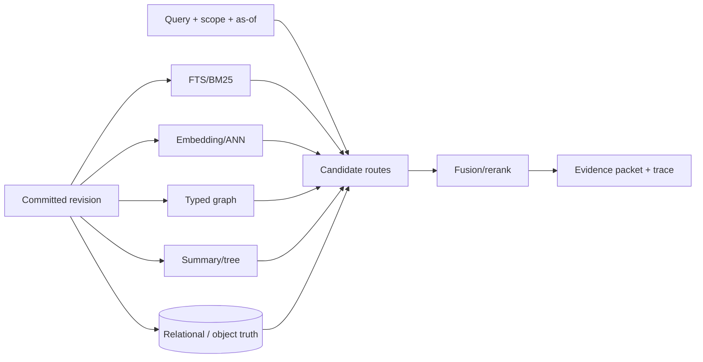

# 权威状态与访问索引：Memory 底座内部到底怎样工作

“用向量库做 Memory”只描述了一条访问路径。一个长期、可修改的 Agent Memory 还要保存原始证据、当前与历史对象、作用域、版本、关系和恢复信息；向量、关键词、图与缓存负责的是候选生成。若不区分权威状态与访问投影，索引漏项会被误认为对象不存在，更新和删除也容易只影响一个副本。

本篇从底座不变量出发，逐一展开关系/WAL、FTS/BM25、向量 ANN、混合融合、图导航、时间/版本和分层文件系统的内部机制。

## 1. 四层存储模型

```text
Evidence ledger
  raw events, receipts, source pointers
        │
        ▼
Canonical state
  typed objects, revisions, scope, validity, lineage
        │
        ▼
Materialized access paths
  FTS/BM25, vectors, entity index, graph, summaries, cache
        │
        ▼
Recovery metadata
  WAL/outbox, schema+model fingerprints, watermarks, snapshots
```

四层可以共处一个 SQLite/Postgres，也可以分布在 object store、search engine 和图后端中。关键不变量是：canonical state 决定对象是否存在及哪个版本生效；projection 可以重建；每个 projection 知道自己覆盖到哪个 revision；恢复知道从哪一份 ledger/snapshot 重放。

## 2. 关系数据库、WAL 与 segment：稳定写入如何形成可恢复状态

### 2.1 SQLite/Postgres 路线

关系型底座适合表达对象 identity、subject/scope、revision parent、valid/recorded time、tombstone 与 receipt。一次写入在事务内提交 canonical row 和必要的 history；FTS trigger 或 outbox 可以在事务内/后生成投影。

SQLite 的优势是单文件、本地事务、FTS5 和低部署负担；限制是并发写锁、跨主机协调和大规模迁移。Postgres 提供多连接、事务、JSON/relational schema 和 pgvector，代价是服务运维、schema migration 和网络故障域。

### 2.2 WAL、memtable 与 immutable segment

搜索引擎式底座通常按以下路径工作：

```text
write request
  → append WAL(sequence number)
  → update in-memory memtable/index
  → background flush
  → immutable segment
  → merge/compaction
```

读请求同时查询 memtable 和多个 segment，再合并结果。WAL 用于崩溃重放，segment 便于压缩和只读搜索；compaction 降低 segment 数，却会造成写放大和尾延迟。固定版本的 [xerj](../../projects/README.md)展示 Rust engine 如何组合 WAL、segments、BM25 与 HNSW/exact vector；它是通用搜索 substrate，不替 Agent 定义 object/revision/scope。

### 2.3 恢复不只是数据库重新打开

Memory 恢复要验证：canonical current/history、FTS/ANN/graph、scope、tombstone 和 receipt 是否指向同一 revision。WAL 能重建表记录，不自动证明 embedding 与外部 object store 已同步；数据库能启动，也不表示应用可见状态一致。

## 3. FTS 与 BM25：精确词法访问为何仍是核心基线

全文索引一般将文档分词，维护 term→document postings、term frequency、document length 等统计。BM25 可简化理解为：词在文档中越重要、在语料中越稀有，得分越高，同时对过长文档和重复词做饱和修正。

```text
score(q,d) = Σ IDF(term) × normalized_term_frequency(term,d)
```

它擅长标识符、专名、代码 symbol、错误信息和精确短语；不需要 embedding provider，也容易做 deterministic rebuild。弱点是同义改写、跨语言和关系/时间问题。

工程实现常将 FTS 作为 fallback 或第一路候选。Sibyl 用 SQLite FTS5；Causal Memory 检索 fact/causal 层的 BM25；OMP reference server 将 query token 转成 quoted OR expression；claude-mem 将 SQLite keyword 与 Chroma semantic 融合。FTS 的现实价值解释了为什么“只有向量”很少是最终形状。

## 4. Embedding 与 ANN：从语义空间取候选

### 4.1 写入路径

文本先经过 chunk/object serialization，再由 embedding model 生成固定维度向量；向量与 object ID、scope/time metadata 和 model fingerprint 一起写入索引。模型、维度、归一化或文本模板变化会产生不兼容空间，不能悄悄混写。

### 4.2 Exact scan、HNSW 与 IVF

- **exact scan**：计算 query 与全部向量的相似度，结果确定，成本随 N 线性增长；
- **HNSW**：维护多层近邻图，从稀疏高层导航到密集底层；查询快、召回高，但写入/内存/重建成本较大；
- **IVF**：先把向量分配到聚类中心，查询只扫描若干倒排桶；更节省搜索量，但训练、桶选择和动态数据分布会影响召回。

ANN 解决的是“在有限计算下找到近邻候选”，不解决 identity、版本、source 或 authorization。metadata pre-filter 可能让 ANN 路径变窄，post-filter 又可能把 top-k 大量删除；两种位置都会改变候选 recall。

### 4.3 Embedding fingerprint 与 rebuild

至少记录 provider/model/revision、dimension、normalization、input template 和 generated_at。Engraphis 固定版本在 fingerprint mismatch 时禁用持久向量召回直到 rebuild；Compartment 在 model hash 不一致时拒绝打开或要求 re-embed。这比混用两个空间后返回不可解释结果更明确。

## 5. 混合索引：多路候选如何融合

混合检索通常并行运行 lexical、semantic、entity、graph、temporal 或 code-symbol 通道。融合有三种常见方式：

### 5.1 归一化加权

将各路分数归一到共同范围，再按权重相加。优点是可表达业务偏好；问题是不同 query 的 score distribution 变化，固定权重不稳定。

### 5.2 Reciprocal Rank Fusion

RRF 不直接比较原始分数，而按每路排名累加：

```text
RRF(d) = Σ 1 / (k + rank_i(d))
```

它对不同 scoring scale 更稳健，Causal Memory 等实现采用此类融合。缺点是每路候选深度、去重与 `k` 仍会改变结果，且无法表达某一路的 hard authority。

### 5.3 Cascade / rerank

先用便宜通道产生较大候选，再用 cross-encoder/LLM/规则重排。它减少昂贵模型调用，却可能在第一阶段永久丢掉必要证据。评测需分别报告 candidate recall 和 rerank 后结果。

混合通道增加鲁棒性，也增加 duplicated candidates、score trace、预算和部分失败。一个通道不可用时，系统应说明降级，而不是保持同一 API 但悄悄改变语义。

## 6. 图索引：关系、PPR 与 spreading activation

图路线将 object/entity 作为节点，将 relation、causal、temporal、semantic 或 lineage 作为边。查询先定位 seed，再沿边扩展：

- bounded BFS/DFS：按类型、方向和 hop 限制遍历；
- Personalized PageRank：从 seed 重启的随机游走，将全局结构与局部相关性结合；
- spreading activation：正/负激活沿加权边传播，可表达促进或抑制；
- community/hierarchy：先定位主题/目录，再逐层 hydrate。

图的主要成本发生在 write/manage：entity resolution、edge extraction、去重、更新和删除传播。错误 hub 或 bridge 会放大污染；旧 edge 若不随 revision 失效，会把历史关系当 current。图索引最好保留 source edge 与 typed relation，而不是只有模型生成的无出处三元组。

[A-MEM](https://arxiv.org/abs/2502.12110)、[Hindsight](https://arxiv.org/abs/2512.12818)、AriGraph 及 Causal Memory 分别展示动态链接、逻辑网络、world model 与 causal edge 的不同图形状；它们不是同一种算法，也不能共享一个“graph memory”分数。

## 7. 时间/版本索引：current、history 与 as-of

一种常见关系 schema 是：stable object table + revision table + current pointer + validity interval。查询 current 选择未撤销、对当前 as-of 有效的 revision；history 返回所有版本；audit/transaction view 还可按 recorded_at 查看系统当时知道什么。

双时间索引可以采用 interval tree、复合 B-tree 或图版本节点；关键是 filter 在候选生成的哪个位置。若先做 ANN top-k 再按时间过滤，大量候选可能被删掉；若按时间切片预过滤，索引数量或维护复杂度上升。bitemporal 论文的小样本反证正说明 filter placement 会影响 temporal reasoning。

## 8. 文件树与分层语义索引

Coding/knowledge systems常用文件或虚拟文件树保存可人工审阅的权威内容，再生成层级摘要与向量：

```text
root overview (L2)
  └─ directory/topic summary (L1)
       └─ file/object detail (L0)
```

查询从 L2/L1 定位子树，再按预算展开到 L0；OpenViking 是这种 shape 的代表。它减少全库向量搜索，也让 URI 成为稳定引用；缺点是 tree move、summary queue、URI/index divergence 和层级边界错误。

## 9. 底座组合的真实数据流



这张图的重点不是“多路越多越好”，而是每一路都有 revision/fingerprint/watermark，候选最终回到 canonical source。若系统无法说明哪个 store 是权威、索引怎样重建、删除怎样传播，多后端只会扩大不一致面。

## 10. 算法选择没有脱离任务的排名

局部事实、专名和代码 symbol 常由 BM25/FTS 强力覆盖；同义改写适合 embedding；多跳关系需要 typed graph；历史/冲突需要版本/时间；大资源树适合层级导航。现实方案往往组合，而不是以一个后端取代所有路线。

当前决定性缺口是 matched workload：相同 raw input、对象 schema、候选深度、token budget、reader 与硬件下，对 flat/hybrid/graph/bitemporal 的 source recall、current/history correctness、maintenance、rebuild 和行动结果进行共同比较。没有这些条件，复杂索引的收益和成本无法归因。

继续阅读[工程底座 walkthrough](02-engineering-walkthroughs.md)和[一致性、恢复与研究前沿](03-consistency-recovery-and-frontier.md)。
