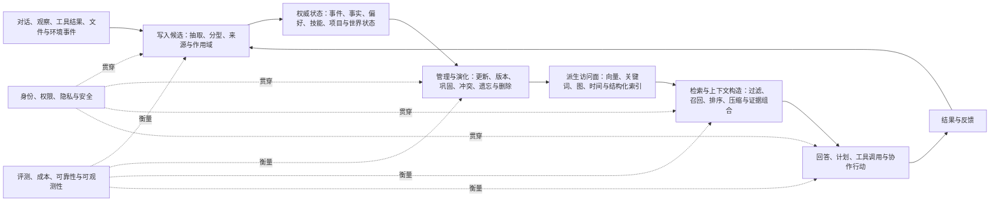

# Agent Memory 2026：一张面向读者的领域地图

**主要证据截止：2026-08-10｜机制补查：2026-08-12｜深潜重编：2026-08-13｜Codex 定向工程补查：2026-08-23**

Agent Memory 研究的不是“如何把聊天记录塞进向量数据库”这么单一的问题。它研究的是：一个 Agent 怎样把过去的对话、观察、工具结果、用户偏好、项目状态和行动经验，转化为可长期保存、可更新、可检索，并且能够在未来任务中安全发挥作用的状态。

这句话包含了五个相互依赖的问题：

1. **记什么**：哪些信息只是本轮上下文，哪些值得跨会话保留；它们是事实、事件、偏好、技能，还是外部世界和项目状态？
2. **怎样写入**：原始观察怎样变成记忆；如何处理重复、矛盾、低质量内容和不可信输入？
3. **怎样维护**：事实发生变化时怎样更新；摘要、巩固、遗忘、删除和恢复分别意味着什么？
4. **怎样读出**：面对当前任务，系统怎样在主体、时间、权限和预算约束下找到最有用的证据？
5. **怎样使用**：召回的内容如何影响回答、计划、工具调用和后续学习，同时不把旧权限、错误经验或攻击载荷带入行动？

当前领域中的论文、产品和开源仓库，大多可以放回这条链路中理解。差别往往不在于是否使用某种数据库，而在于它们选择了什么记忆对象、在哪个阶段进行结构化、把哪些操作交给模型、保留多少可追溯状态，以及怎样评价最终行为。

## 一图看懂：从经历到后续行动

这不是一套推荐架构，也不是所有系统都必须实现的流水线。它是一张**架构解剖图**：简单系统可能只保留其中几段，复杂系统则会把每段进一步拆开。图的价值在于说明不同方案究竟替换了哪一段，以及某个局部改进为何未必能转化为端到端收益。

## 领域现在主要在做什么

### 1. 从“文本片段”转向有类型、有主体、有时间的记忆对象

早期和许多轻量实现倾向于把所有历史都处理成可搜索文本。当前主流研究越来越强调：不同状态的语义不同，不能仅靠相似度统一处理。

- **事件与经历**保留发生过什么、何时发生、结果如何；
- **事实与信念**需要来源、置信度、版本和冲突关系；
- **用户偏好与身份状态**需要用户、用途、有效期、纠正和删除边界；
- **程序与技能**不仅是一段文字，还包含适用条件、工具版本和行动后果；
- **项目与世界状态**依赖代码版本、空间、时间和外部环境；
- **共享状态**还要记录谁可读、谁可改、如何撤销和合并。

因此，“Memory 存在哪里”只是问题的一部分，“存的到底是什么”正在成为更基础的架构分界。详见[记忆对象与作用域](mechanisms/01-memory-objects-and-scope.md)。

### 2. 写入从自动摘要扩展为记忆形成过程

写入端正在从简单的 `save(text)` 分化为多种路线：保留原始事件、抽取原子事实、更新用户画像、从轨迹提炼经验、把程序固化成技能，以及由策略模型动态决定是否写入。

这些路线解决的问题不同。原始记录可追溯但体积增长快；摘要和结构化记录更容易使用，却可能丢失细节或把模型推断固化为事实；自动写入覆盖面广，也扩大了污染和错误累积的入口。新的工作重点不只是提高“记住”的数量，而是区分观察与推断、保存来源、管理写入预算，并让高风险内容在进入长期状态前经过不同程度的筛选。详见[写入与记忆形成](mechanisms/02-write-and-formation.md)。

### 3. 存储正在成为多种权威状态与派生索引的组合

向量检索仍是工程中最常见的访问方式之一，但它通常不再单独承担全部责任。当前系统常把 SQL、文档、对象存储或事件日志作为耐久层，再建立向量、关键词、实体图、时间索引等派生访问面。

几种主要路线各自强化不同能力：

| 路线 | 主要解决的问题 | 擅长之处 | 典型缺口 |
|---|---|---|---|
| 文本/向量记录 | 语义近似召回 | 简单、生态成熟 | 时间、冲突、关系和精确过滤较弱 |
| 混合索引 | 语义与精确事实兼顾 | 对查询措辞更稳健 | 组合与调参复杂，仍依赖底层状态语义 |
| 图与关系表示 | 多跳、实体关系和关联导航 | 保留连接结构 | 建图、更新和查询成本较高 |
| 时间/版本化状态 | 当前值、历史值和纠错 | 能表达 as-of、替代与冲突 | schema 和生命周期控制复杂 |
| 分层/文件式状态 | 人类可读、局部加载和项目上下文 | 易审阅、适合工程资产 | 跨系统一致性和大规模访问仍不统一 |

详见[表示、存储与索引](mechanisms/03-representation-storage-indexing.md)。

### 4. 生命周期控制正在成为独立技术方向

长期状态会不断变化。覆盖旧文本不等于更新成功，搜索不到也不等于删除完成。当前工作把管理过程拆成更细的操作：接纳、去重、合并、替代、衰减、遗忘、撤销、清除、恢复和重建索引。

这里最核心的争议是**何时以及如何压缩状态**。保留原始记录有利于追溯与重新解释，但会增加检索和存储负担；主动巩固能减少噪声和上下文成本，却可能在未来问题出现前就删掉关键细节；学习型控制器可以根据任务选择操作，但自身也会引入不可解释的状态漂移。现阶段不存在跨任务通吃的更新或遗忘策略。详见[生命周期与演化](mechanisms/04-lifecycle-and-evolution.md)。

### 5. 读取从 top-k 搜索扩展为受约束的上下文构造

“能找到相关片段”并不等于“给 Agent 的内容正确且足够”。读取链路正在变成一个组合过程：先解析当前主体、任务、时间和权限，再从多种索引产生候选，随后排序、去重、处理冲突，并在 token 或工具预算内编译成上下文。

主要方案包括语义检索、关键词与字段过滤、混合召回、图导航、时间感知排序、主动多轮检索和面向预算的上下文压缩。它们的相对结果高度依赖任务、数据、模型、检索深度和 token 上限，因此不能从跨协议的单个分数推出普遍优劣。详见[检索与上下文构造](mechanisms/05-retrieval-and-context.md)。

### 6. Memory 的评测目标从“回忆正确”走向“行为正确”

Memory 最终通过 Agent 的回答与行动体现价值。当前研究开始测量更长的链路：是否在正确时机写入、能否在状态变化后修正、是否把证据用于工具参数、能否迁移经验、是否会传播污染，以及删除后衍生状态是否仍影响行为。

程序性记忆和经验学习尤其明显：它们把一次任务的轨迹转化为规则、反思、脚本或可执行技能，再在后续任务中复用。这里的关键分界是“召回经验”和“授予行动权”并非同一件事。一个历史技能即使相关，也可能因工具版本、环境、权限或安全状态改变而不再适用。详见[使用、反馈与技能学习](mechanisms/06-use-feedback-and-skills.md)。

## 三类横切问题

Memory 的主要风险和评价问题都跨越整个生命周期，不能作为数据库选定后的附录。

### 评测：没有一个统一的 Memory 分数

对话问答、增量更新、工具行动、多智能体协作、长期可靠性和安全评测测量的是不同能力。只有任务、数据版本、模型、上下文构造、检索预算、工具循环、评价器和指标一致时，数值才具有直接可比性。详见[评测与 Benchmark](cross-cutting/01-evaluation-and-benchmarks.md)。

### 安全与治理：攻击链跨越写入、读取和行动

不可信内容可以在写入时污染长期状态，也可以在未来查询时被激活；用户画像会带来隐私抽取和跨主体泄露；删除一条主记录也未必清除摘要、向量、图边、缓存和行为依赖。当前防护逐渐从输入过滤转向来源、作用域、权限、版本、隔离、撤销与行动时重新授权的组合。详见[安全、隐私与治理](cross-cutting/02-security-privacy-governance.md)。

### 工程性：收益必须和全生命周期成本放在一起看

Memory 的成本不仅是一次向量查询。写入抽取、模型调用、图或向量投影、重排、压缩、索引重建、冲突修复、删除传播、安全扫描和人工审核都会增加持续成本；可靠性还涉及写入失败、派生索引落后、迁移、恢复和可观测性。详见[成本、可靠性与可观测性](cross-cutting/03-cost-reliability-observability.md)以及[互操作与集成](cross-cutting/04-interoperability-and-integration.md)。

## 应用场景怎样改变同一套问题

应用场景不是另一套互不相干的 Memory 分类，而是对上述机制的不同组合。

| 场景 | 主要记忆对象 | 最突出的约束 | 对应视图 |
|---|---|---|---|
| 个人助手与长期对话 | 事件、偏好、关系、承诺、用户纠正 | 身份连续性、隐私、过期偏好和跨域泄露 | [个人助手](scenarios/01-personal-assistants.md) |
| Coding Agent | 代码结构、决策、任务状态、错误、构建与工具结果 | 仓库/分支/提交作用域、快速变化、秘密和跨会话交接 | [Coding Agent](scenarios/02-coding-agents.md) |
| 多 Agent 与共享记忆 | 任务、消息、经验、共享工件和组织规则 | 权限、来源、冲突、污染传播、撤销与可移植性 | [多 Agent](scenarios/03-multi-agent-shared-memory.md) |
| 世界状态、具身与多模态 | 时空观察、对象、地图、动作结果和多模态事件 | 部分可观测、状态漂移、模态对齐和行动闭环 | [世界状态与具身](scenarios/04-world-state-embodied-multimodal.md) |

Codex 定向补查为 Coding Agent 场景增加了一个现役开源 runtime：它采用两阶段 LLM 形成、独立 SQLite candidate/job store、Git-baselined Markdown 工件与词法渐进读取，而不是把项目历史直接交给向量检索。该结论只更新 Codex 这一实例，详见 [Codex 本地 Memory 系统](projects/openai--codex.md)。

长上下文、普通 RAG、模型参数记忆、持续学习和 checkpoint 与这些问题相邻，但不都属于本文主体。它们在承担跨会话持久状态、显式写入管理或未来行动依赖时才与 Agent Memory 重叠。详见[相邻技术边界](adjacent-boundaries.md)。

## 当前形成的共识、分歧与空白

### 相对稳定的认识

- Memory 是一条状态生命周期，而不是一种数据库的别名。
- 记忆对象、主体、时间、来源和版本会直接影响后续检索与行动，不能完全依赖模型在最后一步自行推断。
- 向量、关键词、图和时间索引解决不同失配，当前工程更常见的是组合而非单一路线取代所有路线。
- GitHub 代码和文档是理解真实架构的重要证据，但仓库存在、Star 和 CI 文件不能证明性能、增长、生产采用或安全性。
- 评测结果强烈依赖协议，跨任务或跨预算的总榜往往掩盖真正差异。

### 仍然存在的分歧

- 何时自动写入，何时只保留原始历史；
- 构造化、压缩后的记忆是否能在同预算下稳定优于原始记录；
- 图与主动导航的收益能否覆盖建图、维护和查询成本；
- 学习型生命周期控制是否能跨任务稳定工作，并避免不可逆错误；
- 共享记忆带来的协作收益是否能与权限、污染和冲突成本同时闭环。

### 尚未解决的主要问题

- 缺少一个统一但不抹平任务差异的全生命周期实验框架；
- 删除、纠正和撤销是否真正传播到摘要、索引、缓存、备份和后续行为，公开证据仍薄弱；
- 多数开源系统缺少可独立审计的长期生产部署、跨租户隔离和失败恢复证据；
- 项目协议正在增多，但独立的同版本互操作、双向往返和一致性报告仍稀缺；
- 新型自动管理、经验晋升和主动检索机制多处于作者实验或早期实现阶段，跨系统复现不足。

这些不是留给人工补写的空白。本套报告已经给出当前可见的方案空间和暂定判断；[人工评审清单](human-review.md)只标出少数可能值得改判或继续深挖的高影响问题。

## 最近一年，变化发生在哪里

截至 2026-08-10，领域最近的变化不是某一种数据库突然胜出，而是原来混在“存下来再搜索”里的责任正在被拆开：

- **状态开始有类型、身份、时间和版本。** 原子事实、事件、用户状态、程序、项目状态和世界状态逐渐采用不同的更新与读取规则；时间有效性和系统获知时间也开始被分别表示。
- **写入、巩固、遗忘和恢复成为显式操作。** 新工作不再只比较检索器，而是研究何时接纳、合并、替代或清除一条状态，以及失败后能否恢复。
- **评测从历史问答扩展到状态变化与行动。** 新基准开始分别测试更新、选择性遗忘、工具参数、多步环境行动和安全生命周期；因此不同协议的分数不能拼成一个总榜。
- **安全边界延伸到未来行动。** 污染、组合式攻击、隐私泄露和“存储已更新但行为仍陈旧”等结果表明，输入过滤本身不足以描述完整风险。
- **工程实现快速分化。** v09 观察的 59 个 GitHub 候选中，19 个创建于最近 90 天、39 个创建于最近 12 个月、54 个在最近 90 天有推送；这些数字说明实现表面正在扩张，但不证明质量、增长速度或生产采用。

最近 90 天尤其密集的弱信号包括双时间状态、学习型生命周期控制、预算感知巩固、事务式记忆、主动导航，以及更细的攻击与修复模型。多数仍是预印本、早期仓库或作者实验，因而适合放回既有技术脉络观察，还不足以称为新的统一主流。完整材料、代表工作与证据边界见[近期变化](trends.md)。本报告不设“奠基工作”章节；旧工作只在解释当前路线时短暂出现，新项目也不会仅因创建时间或 Star 数进入主流结论。

## 阅读路线

- **5 分钟：** 本页，建立全局地图并理解近期变化的方向。
- **15 分钟：** 本页 + [通用架构模型](architecture.md)，理解模块与数据流。
- **30 分钟：** 本页 + 架构模型 + [近期变化](trends.md)。
- **专题阅读：** 进入一个[机制分支](mechanisms/)或[场景视图](scenarios/)。
- **工程阅读：** 先看[GitHub 候选雷达](github-radar.md)，再进入少量重点[项目报告](projects/)。
- **研究边界：** [方法与范围](method-and-scope.md)和[人工评审清单](human-review.md)；内部分类映射保存在[审计目录](../audit/old-to-new-map.md)。
