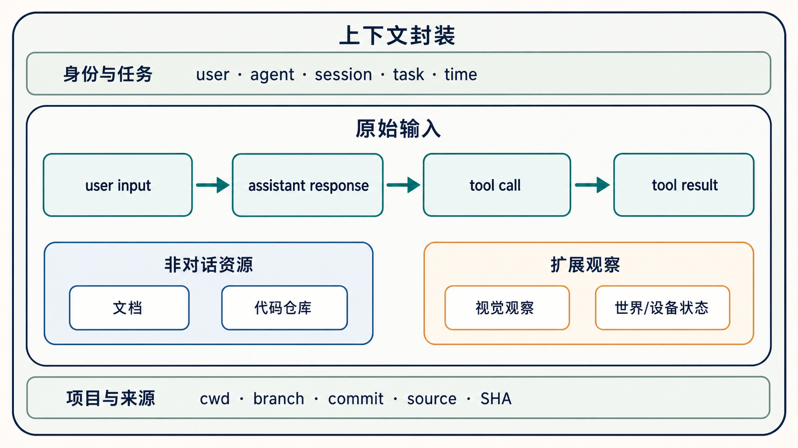
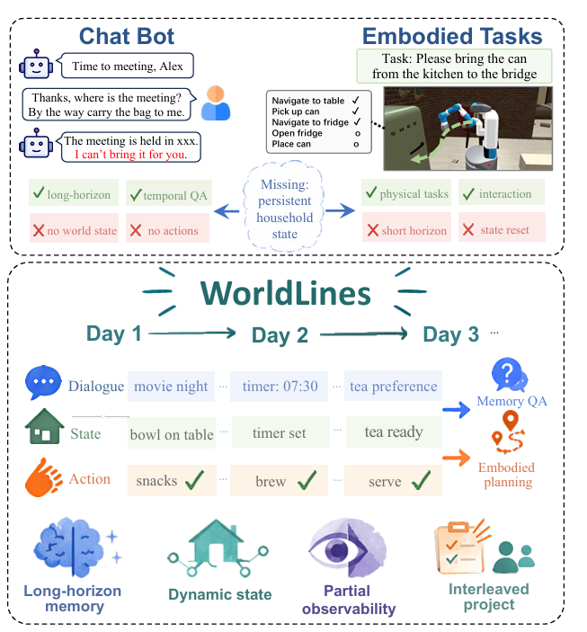

# 第 1 层：输入

Agent Memory 的第一层只回答一个问题：**系统实际收到了什么？** 当前 Agent 主要以对话方式工作，因此最重要的输入主干是按时间发生的交互—执行事件：`user input → assistant response → tool call → tool result`。

原始输入还包括文档、代码仓库、视觉观察，以及世界或设备状态。每条输入同时带着定位其含义的上下文，例如 user、agent、session、task、时间，以及 cwd、branch、commit、source 和 SHA。并非每种输入都有全部字段，而是携带与自身相关的定位信息。

## 世界与设备状态：WorldLines

当前 Agent 虽然主要由对话触发，但 Memory 的原始输入不一定来自一轮对话。对象或设备的状态发生变化时，也可以独立产生一条带时间的输入事件。WorldLines 将 Dialogue、State 和 Action 放在同一条跨天轨迹中，展示对话输入与非对话状态输入怎样共同积累。

*[《WorldLines: Benchmarking and Modeling Long-Horizon Stateful Embodied Agents》](https://arxiv.org/abs/2606.18847v2)，Figure 1。*

例如，咖啡机连续多个工作日都在 07:00 从 `idle` 变为 `brewing`，约 12 分钟后变为 `ready`。Memory 记录这些每天发生的状态变化后，就能知道这是一个日常规律；如果某天到 07:15 仍然是 `idle`，后续分析便能发现这次变化与往常不同。这个例子说明，即使没有用户发起新对话，状态变化本身也可以成为有价值的 Memory 输入。
