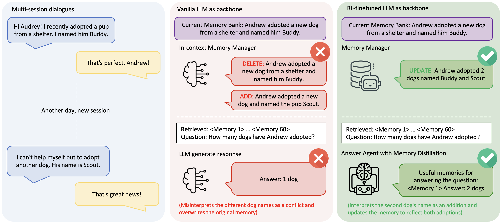
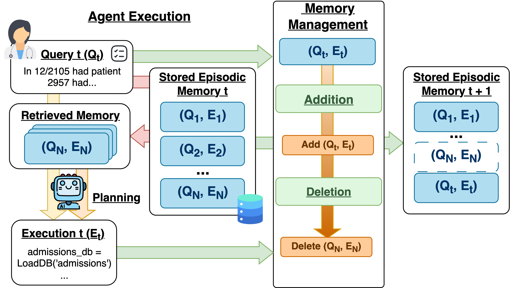

# 第 2 层：提炼与管理

输入层保存的是原始材料，其中只有一部分值得长期保留。提炼负责从输入中筛选、抽取和去重，管理则决定提炼结果应该新增、更新、合并，还是不写入。

```text
输入层材料
→ 筛选、抽取、去重
→ 与已有 Memory 比较
→ create / update / merge / no-op
→ 形成或更新后的 Memory
```

不同系统还会增加自己的管理机制，例如优先级、热度、版本、使用信号和遗忘。这些机制不一定处于同一条流水线上，但都会影响哪些内容成为当前 Memory、哪些被保留为历史，以及哪些逐渐退出。

## TencentDB：从 L0 到 L3 的逐层提炼

[TencentDB Agent Memory](https://github.com/TencentCloud/TencentDB-Agent-Memory/tree/0aff21a)把对话 Memory 分成 L0、L1、L2 和 L3，同时从执行轨迹形成 Skill，并把文档与代码仓库分别形成 Wiki 和 CodeGraph。


*[TencentDB Agent Memory 技术实现总览](https://github.com/TencentCloud/TencentDB-Agent-Memory/blob/0aff21a2d9f2b8a0354aaa80a2e586aab4054562/assets/images/flowchart5.png)。本层聚焦左侧 `Memory Processing` 虚线框。*

虚线框从上到下展示四条提炼路径：Conversation 逐层形成 L0–L3，Workflow Execution 形成 Skills，Documents 形成 Wiki，Codebase 形成 CodeGraph。右侧 Memory Assets、Memory Hub 和 New Task 负责资产登记、权限与后续使用，不在本层展开。

### Conversation → L0 → L1 → L2 → L3

这条主链从原始消息开始，逐步形成原子 Memory、场景和长期 Persona。四层不是四份相同内容，而是抽象程度不同的结果。

#### L0：保留发生过的消息

L0 保存本轮新增的 user 和 assistant 消息，以及 user、agent、session、task 和时间等定位信息。它只负责记录，不在入口处总结，也不表示这些消息已经成为长期 Memory。

#### L1：提炼成可独立理解的原子 Memory

L1 从一批 L0 消息中抽取以后仍可能有用的事实、偏好、任务、方法或资产。内容必须脱离原对话仍能理解；信号不足时可以不产生任何 Memory。

一条 L1 是可以独立检索和继续更新的原子记录，形态可以概括为：

```json
{
  "type": "work_method",
  "content": "修复行为缺陷前先建立稳定失败的复现测试",
  "priority": 90,
  "source_message_ids": ["msg-a1"],
  "version": 1
}
```

`content`保存提炼后的最小事实或方法，`source_message_ids`指回原始消息，`priority`和`version`则供后续管理使用。

新候选还会与已有 L1 比较，再选择：

| 操作 | 含义 |
|---|---|
| `store` | 没有相关旧项，新增一条 Memory |
| `update` | 新证据修正或补充一个已有对象 |
| `merge` | 新旧内容属于同一对象，合并为新的当前表示 |
| `skip` | 内容重复、价值不足或不应保存 |

L1 同时保存来源、类型、优先级和版本，使后续更新仍能回到原始消息。

**管理触发：** 每轮对话结束后，新消息先进入当前 Session 的缓冲区。新 Session 默认按 1 → 2 → 4 → 5 轮逐步扩大处理批次，稳定后每 5 轮运行一次 L1；不足一批但连续 10 分钟没有新对话，也会处理剩余消息。每次运行都把新候选与已有 L1 比较，执行 `store / update / merge / skip`。

#### L2：把原子 Memory 整理成场景

L2 将多条相关 L1 整理成一个可复用场景，例如把“修缺陷前先复现”和“修改后运行回归”组织成“缺陷修复与回归验证”Scene。Scene 不只是摘要，还会写清适用条件、操作步骤、判断逻辑和反模式。

它的具体产出是一份 Scene Markdown：

```markdown
-----META-START-----
created: 2026-08-20T09:00:00Z
updated: 2026-08-25T14:30:00Z
summary: 修复行为缺陷时的复现、修改与回归流程
heat: 3
-----META-END-----

## 适用条件
已有行为与预期不一致，需要修改实现。

## 核心 SOP
1. 先建立稳定失败的复现测试。
2. 修改最小范围实现。
3. 复现转绿后运行相关回归。

## 禁忌与反模式
没有失败证据就直接修改代码。
```

因此 L2 已经不是一条事实，而是一份特定场景下可以再次阅读和执行的方法文档。

面对新 L1，Scene 可以执行 `CREATE / UPDATE / MERGE / NO-OP`。每个 Scene 还带有 heat：新建时从 1 开始，更新时递增，合并时累加。它用于导航排序，并在 Scene 数量接近上限时辅助合并或删除选择。

**管理触发：** L1 完成后会安排下一次 Scene 整理：默认至少等待 10 秒，并与上一次 L2 保持 15 分钟间隔；活跃 Session 最长每小时再检查一次。L2 从上次处理位置继续读取新增或变化的 L1，再决定新建、更新、合并 Scene，或者保持不变。

#### L3：形成跨场景的长期准则

L3 从多个 Scene 中继续提炼长期 Persona。它不会把所有 Scene 机械拼接，而是合并重复原则、排除临时状态，并在新证据出现时收窄或修正旧规则。

它的产出是当前 team + agent 范围下的 `persona.md`。正文保存跨场景仍然稳定的偏好和准则，文件末尾再附 Scene 导航：

```markdown
# persona.md

# Team Operating Doctrine

> **Operating Thesis**: 修改必须先建立与任务类型相匹配的验证基线。

## Core Principles
- 缺陷修复先建立失败证据。

## Reusable SOPs
- 纯重构先建立行为基线，完成后运行相关回归。

## Decision Logic
- 先判断是行为缺陷还是纯重构，再选择验证方式。

## Boundaries & Anti-patterns
- 不要在没有失败证据或行为基线时直接修改实现。

## Scene Navigation
- 缺陷修复与回归验证：path / summary / heat
- 发布与回滚：path / summary / heat
```

新 Session 可以先获得这份长期准则，再沿导航按需打开具体 Scene。

**管理触发：** 每次 L2 完成后都会检查是否需要更新 L3。首次形成 Scene 且还没有 Persona 时立即生成；此后出现显式更新请求、`persona.md` 正文丢失，或累计 50 条新 L1 时再更新。大范围变化重写全文，局部变化精确修改相应段落，完成后重新附上最新 Scene 导航。

例如：

```text
L0：用户说“修复缺陷前先写失败测试”
→ L1：修改前建立失败证据
→ L2：缺陷修复与回归验证场景
→ L3：缺陷修复先建立失败证据

后来用户补充“纯重构没有待修复失败，但要先锁定行为基线”
→ L1 / L2 更新条件
→ L3 改为：缺陷修复先失败测试；纯重构先建立行为基线
```

这条链同时体现了提炼和管理：第一次形成时逐层抽象，新证据到来后再更新已有 L1、Scene 和 Persona。

### Workflow Execution → Skills

Skill 走另一条链。它的输入不是只看 user 与 assistant 的对话，而是一段同时保留 tool call 和 tool result 的执行轨迹。

```text
每轮执行轨迹 → Session Buffer
├─ 自动触发：累计 10 次 tool call 或 40 KB
└─ 主动触发：强制归档当前 Buffer，或直接提交选定轨迹
→ Archive
→ Review
→ create / update / patch / files_write / no-op
→ versioned SKILL.md
```

正常链路在每轮结束后把新增轨迹追加到当前 Session Buffer。默认累计到 10 次 tool call，或 Buffer 达到 40 KB，就归档当前轨迹并清空计数；一次新增轨迹本身达到 40 KB，也会立即归档。调用方还可以直接归档当前 Buffer，或提交一段选定轨迹进入同一条 Review 链，不必等待自动阈值。

归档只表示“值得检查”，还不表示一定生成 Skill。Review 会先把候选区分为 Skill、Memory、Wiki、CodeGraph 或临时上下文；只有可复用、任务边界明确、能指导执行的 Skill 候选才继续。候选还要通过四项评分：能力定位、任务边界、复用与泛化、可执行流程，总分至少 72，且任何一项不能低于 12。

系统会先提供最近更新的最多 5 个 Skill 作为线索；Review 仍要列出当前 Skill 库并打开相似项，再决定管理动作：

| 轨迹带来的变化 | 管理动作 |
|---|---|
| 出现一个现有 Skill 未覆盖的新任务类型 | `create`：创建 v1 |
| 现有 Skill 只缺一个步骤、分支或纠错 | `patch`：局部修改 |
| 现有 Skill 的流程需要整体重写 | `update`：替换完整 `SKILL.md` |
| 需要补充脚本、模板或参考材料 | `files_write`：写入 supporting files |
| 不属于 Skill、评分不足、内容重复或已有 Skill 已覆盖 | `no-op` |

更新已有 Skill 前，Review 必须先读到当前版本，并在写入时携带 `expected_version`。成功写入会追加一个新版本并切换 active head；如果期间已有其他更新使版本过期，就重新读取最新版本再判断，而不是覆盖刚发生的变化。

具体产出是一个版本化能力包：

```text
auth-token-revocation
├─ SKILL.md
├─ files/
│  ├─ scripts/
│  ├─ templates/
│  └─ references/
└─ resource manifest

v1 → v2 → v3（active head）
```

其中 `SKILL.md` 会写清适用与不适用条件、所需输入、操作流程、判断规则、输出格式、验证方式和常见陷阱；`references/`、`scripts/`等 supporting files 承载正文放不下的材料或可执行工具。

Chat Memory 主要从对话中提炼事实、场景和长期准则；Skill 则从实际执行过程提炼以后可以再次运行的工作方法。

### Documents → Wiki；Codebase → CodeGraph

图中另外两条路径处理非对话材料，它们的产出都是知识图谱，但图谱对象不同：

```text
Documents → Wiki 知识图谱
页面节点：概念、方案、说明文档
关系边：页面链接、相关概念、引用关系

Codebase → 代码知识图谱
节点：文件、类、函数、符号
关系边：定义、调用、导入、依赖
```

Wiki 同时保留可读的 Markdown 页面，CodeGraph 则固定到具体 branch 和 commit。它们都不是把原文简单切成一堆 chunk，而是把内容和内容之间的关系也保存下来；更新文档或代码后，相应图谱和索引需要重新同步。

## Codex：两阶段提炼与文件级管理

[Codex Local Memory](https://github.com/openai/codex/tree/c9b19deb09c1841ce7acc33ddb96276030936a29)把过去完成的任务整理成本地文件，让新的任务能够复用之前发现的项目知识、用户偏好、工作方法和失败经验。任务完成后，user、assistant、工具调用和工具结果先保留在 rollout 中；后续 root Session 启动时，后台流程再处理已经结束并空闲的 rollout。

```text
一次任务的 rollout
→ Phase 1：提炼该任务的候选 Memory
→ memories_1.sqlite：保存候选与来源

多条候选 + 已有 Memory 文件 + 来源变化
→ Phase 2：跨任务合并、去重和改写
→ memory_summary.md / MEMORY.md / rollout_summaries / skills
```

**Phase 1：先理解一次任务。** 抽取模型每次只看一个 rollout，判断其中有没有能帮助未来任务的信息。它不会把整段对话压成一篇摘要，而是输出三个字段：

```json
{
  "rollout_summary": "这次任务做了什么、结果如何",
  "rollout_slug": "便于定位这次任务的短名称",
  "raw_memory": "可能影响未来 Agent 行为的候选经验"
}
```

例如，一次退款测试任务发现：fixture 仍使用旧字段 `refund_status`，修改 fixture 后测试恢复。Phase 1 可以把它提炼为“处理退款集成测试失败时，先检查 fixture schema 与当前字段是否一致”。没有可复用信息时，Phase 1 直接产生 no-op。此时结果只是带来源的候选，未来任务还不会直接读取它。

**Phase 2：再整理多次任务。** Phase 2 选择一批候选，同时读取现有 Memory 文件和相对上次成功结果的变化，然后按项目与任务类型重新组织内容。相近经验会合并，重复内容会去除，新证据可以补充、收窄或替换旧结论；如果来源已经退出，依赖它的内容也可以从当前文件中移除。

最终产出各有分工：

| 文件 | 作用 |
|---|---|
| `memory_summary.md` | 一份短导航，告诉新任务有哪些长期信息可以继续查 |
| `MEMORY.md` | 按项目和任务类型组织的详细手册，保存经验正文与来源线索 |
| `rollout_summaries/` | 保存每次历史任务的简要过程，供需要证据时继续下钻 |
| `skills/` | 当候选足以形成独立、可执行流程时，保存为可复用 Skill |

前面的退款测试候选进入 Phase 2 后，可能被写入 `MEMORY.md` 的 “Payments / refund integration tests” 小节；`memory_summary.md` 只保留“退款测试：fixture schema 与字段迁移”这条导航。以后再遇到退款测试失败，新任务先看到导航，再按需打开详细条目。

候选在后续任务中被引用后，Codex 会更新它的使用次数和最近使用时间，这些信号会影响下一轮 Phase 2 的候选选择。

因此，Codex 管理的核心不是一组逐层升级的 Memory 对象，而是一套持续改写的本地手册：Phase 1 保留每次任务的候选与来源，Phase 2 决定当前手册最终应该怎么写。

## 前沿探索：学习型管理与效用遗忘

### Memory-R1：从规则选择到学习策略

[Memory-R1](https://aclanthology.org/2026.acl-long.583/)保留了常见的 `ADD / UPDATE / DELETE / NOOP` 操作，但不再只依靠固定 Prompt 选择动作。它用强化学习训练一个 Memory Manager，让管理策略直接从后续任务结果中学习。



*[Memory-R1: Enhancing Large Language Model Agents to Manage and Utilize Memories via Reinforcement Learning](https://aclanthology.org/2026.acl-long.583/)，Figure 1。*

图的左侧是两次不同 Session：Andrew 先收养了 Buddy，后来又收养了 Scout。中间的普通 Memory Manager 把两个名字误判为互相冲突，先删除 Buddy，再新增 Scout；Memory Bank 最终只剩一只狗，后续问题也只能回答“一只”。

右侧的 RL Memory Manager 判断第二条信息是在补充第一条，于是执行一次 `UPDATE`：

```text
Andrew adopted a dog named Buddy
+ Andrew adopted another dog named Scout
→ Andrew adopted two dogs named Buddy and Scout
```

它的完整管理过程是：

```text
新对话
→ 提炼候选信息 x
→ 检索相关旧 Memory M_old
→ Memory Manager 输出 (operation, updated content)
→ 更新 Memory Bank
```

四种动作分别处理不同关系：

| 动作 | 何时选择 |
|---|---|
| `ADD` | 没有相关旧项，候选形成一条新 Memory |
| `UPDATE` | 新信息补充或修正已有对象，生成合并后的内容 |
| `DELETE` | 已有内容被明确推翻，不应继续保留 |
| `NOOP` | 新信息重复、无关，或不值得改变 Memory |

训练阶段会把 Manager 选出的动作实际应用到 Memory Bank，再让固定的 Answer Agent 使用更新后的 Memory 回答后续问题。答案与标准答案一致时获得奖励；PPO 或 GRPO 据此提高这类管理动作的概率。训练完成后，Manager 学到的不只是操作名称，还包括什么时候合并、什么时候覆盖，以及更新后的 Memory 应该怎样表达。

```text
固定 Prompt 管理：规则决定 operation
Memory-R1：后续回答结果训练 operation policy
```

这使 `ADD / UPDATE / DELETE / NOOP` 从一组人工规定的动作，变成一套由任务效果训练出来的管理策略。论文在 LoCoMo、MSC 和 LongMemEval 上验证了这套方法，并覆盖 3B 到 14B 的不同模型规模。

### 历史效用删除：常被使用不等于值得保留

[How Memory Management Impacts LLM Agents](https://aclanthology.org/2026.acl-long.27/)研究的是 episodic Memory：每条记录保存一次历史任务的 query 与 execution，以后作为示例指导相似任务。论文把新增、使用反馈和删除放进同一条持续变化的链路。



*[How Memory Management Impacts LLM Agents: An Empirical Study of Experience-Following Behavior](https://aclanthology.org/2026.acl-long.27/)，Figure 1。*

图从左向右展示一次 Memory 更新。`Q_t` 是当前任务，`E_t` 是 Agent 完成该任务的执行过程与结果，例如生成的代码、规划轨迹或最终判断。系统先从 `Memory_t` 取回若干历史记录 `(Q_i, E_i)`，Agent 参考这些经验完成本次执行。任务结束后，Memory Management 一方面判断是否加入新的 `(Q_t, E_t)`，另一方面决定哪些旧记录应该删除，最后形成 `Memory_{t+1}`。

使用频率可以找到“长期没人需要”的冷 Memory，但它无法识别另一类问题：一条经验可能经常被相似任务命中，却持续把 Agent 引向错误做法。论文因此为每条被取回的 Memory 继续记录它对后续任务的实际影响：

```text
Memory i 每被使用一次：
retrieval_count_i += 1
utility_sum_i += 本次任务的评价 Φ

average_utility_i = utility_sum_i / retrieval_count_i
```

其中 `Φ` 由任务评价器给出，可以是成功/失败、与标准答案的 Exact Match，或自动评价结果；它表示使用这些 Memory 后，本次任务完成得怎么样。

删除不会由一次偶然失败触发。只有当一条 Memory 已经被使用至少 `n` 次，平均效用仍低于阈值 `β` 时，history-based deletion 才把它移出 Memory Bank：

```text
retrieval_count_i > n
且 average_utility_i ≤ β
→ DELETE Memory i
```

例如，一条旧的故障处理经验被连续取回八次，却在多数任务中导致验证失败。它的访问次数很高，按普通 heat 会显得“活跃”；历史效用则会持续下降，最终触发删除。这避免了错误经验因为反复被命中、反复被模仿而不断自我强化。

论文同时给出一种更简单的 periodical deletion：如果某条 Memory 在最近时间窗口内的取回次数低于阈值，就把它作为冷数据删除。两种条件可以组合：长期不用的内容控制容量，经常使用但效果差的内容控制质量。

```text
冷：最近很少被取回
或
差：多次被使用后平均效用仍低
→ 从当前 Memory Bank 删除
```

TencentDB Scene 的 heat 主要记录 Scene 被创建、更新和合并的活跃程度；这里的历史效用进一步记录“Memory 被实际使用以后发生了什么”。论文在 EHR、自动驾驶和 IoT 等四类 Agent 上验证了这套删除策略，并说明可靠的任务评价器是效用遗忘能够生效的关键。
