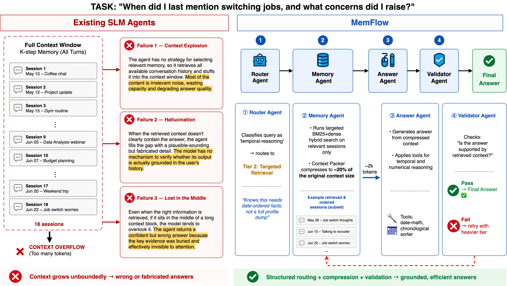
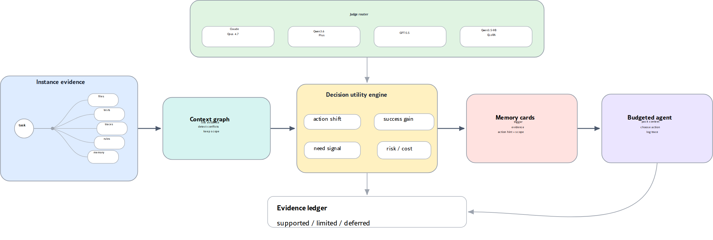

# 第 3 层：读取与编排

形成后的 Memory 不会全部进入当前 Prompt。读取与编排负责从长期状态中选择这次任务需要的内容，并控制它以什么顺序、多少篇幅进入上下文。

```text
少量稳定正文、目录和工具说明进入 Prompt
→ Agent 根据当前任务选择 Memory 路径
→ 调用搜索或读取工具
→ 工具返回相关正文或原始证据
→ 在 token 预算内编排进当前上下文
```

直接注入适合短而稳定的内容；较长的 Memory 只先提供名称、摘要、路径和工具说明，Agent 判断相关后再调用工具读取。工具结果作为本轮动态上下文进入推理，这样不会把整个 Memory 库一次性塞给模型。

## 3.1 TencentDB：多类 Memory 按任务组合

[TencentDB Agent Memory](https://github.com/TencentCloud/TencentDB-Agent-Memory/tree/0aff21a)在新 Session 中先向 Prompt 提供少量稳定内容。L3 Persona 正文直接约束 Agent 的默认判断；Scene、Skill、Wiki 和 CodeGraph 只先提供名称、摘要、路径和相应工具说明。具体内容由 Agent 根据当前任务调用工具加载。

```text
新 Session 的 Prompt
├─ L3 Persona 正文：直接注入
├─ Scene 索引：path / summary / heat
├─ Skill 目录：name / description
└─ Wiki / CodeGraph：资源描述与工具说明
       ↓ Agent 根据任务调用工具
       ├─ 读取 L2 Scene Markdown
       ├─ 搜索 L1 原子 Memory
       ├─ 搜索或读取 L0 原始对话
       ├─ 读取 SKILL.md 与必要 supporting files
       ├─ 搜索并读取 Wiki 页面
       └─ 查询 CodeGraph 的代码结构与影响范围
       ↓
工具结果进入本轮动态上下文
```

L1 提供的是提炼后的结论，L0 保留更接近原始对话的证据；Scene、Skill、Wiki 和 CodeGraph 则分别提供方法、可执行流程、文档知识和代码关系。它们只有在当前任务需要时才通过工具进入上下文。

例如用户说：“按上次约定修复 refresh token 撤销问题，解释设计原因，并确认改动影响。”同一轮可以这样装配：

```text
L3 Persona：直接提供“先建立验证证据”的长期准则
L1/L0 工具：找回“共享 revocation store”的历史约定与原话
Scene 读取工具：加载缺陷修复与回归场景
Skill 工具：加载 token-revocation workflow 与验证步骤
Wiki 工具：搜索并读取选择共享 Store 的设计页
CodeGraph 工具：查询实现位置和改动影响范围
```

最终进入上下文的是直接注入的 L3、各类轻量目录，以及工具在本轮返回的少量正文和证据。

## 3.2 Codex：短索引直注，文件按需读取

[Codex Local Memory](https://github.com/openai/codex/tree/c9b19deb09c1841ce7acc33ddb96276030936a29)把读取组织成“短索引直接进入 Prompt，详细文件由工具按需读取”。新 Thread 先获得 `memory_summary.md`，用它定位可能相关的项目和任务类型；需要细节时，Agent 再调用搜索和读取工具访问 `MEMORY.md` 的命中行范围。

```text
memory_summary.md：短索引，直接进入新 Thread 的 Prompt
→ 搜索工具查询 MEMORY.md，定位相关 task group
→ 读取工具加载命中行，取得当前手册、命令和 Sources
→ 需要过程证据时，用工具读取 rollout summary
→ 需要精确原话、命令或错误时，用工具读取原始 rollout
```

`skills/` 也采用相同方式：先根据名称和说明定位相关 Skill，再通过工具读取 `SKILL.md` 与必要文件。直接注入的 summary 负责导航，详细内容由工具按需加载。

例如新 Thread 在 `/repo/auth-service` 收到“按以前验证过的方式改 refresh token”：

```text
memory_summary：定位 auth-service / token revocation
→ search MEMORY.md：找到共享 Store 与测试命令
→ read 对应行：取得当前手册和 th-42/th-51
→ 必要时读 rollout summary：确认历史验证结果
→ 仍有歧义才沿 rollout_path 查看原始 JSONL
```

最终进入推理的只有被选中的文件片段，并与当前 user message 和新 tool results 一起组成上下文。回答采用 Memory 时附带文件行与 rollout IDs，后续再形成 usage 反馈。

## 3.3 MemFlow：先识别意图，再执行固定读取流程

[MemFlow](https://arxiv.org/abs/2605.03312)面向难以稳定选择工具和组织长历史的小模型。它先用 Router 判断问题类型，再由确定性程序完成 Memory 检索与编排，让主回答模型只处理已经选好并整理过的证据。



*[MemFlow: Intent-Driven Memory Orchestration for Small Language Model Agents](https://arxiv.org/html/2605.03312v1)，Figure 1。*

图中的任务要从 18 个 Session 里找到最近一次“换工作”的谈话及当时的顾虑。左侧直接加载完整历史，容易产生上下文膨胀、无关噪声和关键证据被淹没；右侧先判断问题类型，再执行对应的读取流程。

```text
query
→ Router：规则优先，必要时调用小模型识别 intent
→ action_tag 选择固定 Memory workflow
→ 程序执行检索、排序、过滤和 Context Packing
→ Answer Agent 调用模型，根据证据回答
→ Validator 先做规则检查，必要时调用模型判断是否升级重试
```

图中虽然把中间模块标为 `Memory Agent`，但它不是一次模型调用，而是按 `action_tag` 分发的程序模块。一套 workflow 会预先固定四件事：从哪里读取、怎样检索和处理、分配多少上下文，以及 Answer Agent 可以使用什么 Prompt 或计算工具。

| Router 识别出的 intent | 固定 workflow |
|---|---|
| 用户画像 | 直接读取预先整理的 Profile，不搜索历史对话 |
| 明确事实 | 对完整 query 做关键词与向量检索，再按人名或实体补充检索；合并、去重和排序结果 |
| 时间问题 | 分别检索问题中的事件或日期，按时间排序；需要时调用日期计算工具 |
| 新旧事实冲突 | 跨 Session 找到同一事实的多个版本，按时间排序并过滤旧状态 |
| 跨 Session 汇总 | 从不同 Session 取样，避免结果集中在单次对话，再做分组汇总 |
| 规则核对 | 优先保留包含 always、never、must、allowed 等约束的句子 |
| 状态变化 | 按时间收集同一对象的变化记录，形成完整演化顺序 |

以图中的问题为例，Router 将“最近一次提到换工作以及当时的顾虑”识别为时间类问题。对应程序先检索包含“换工作”和“顾虑”的相关 Session，再按日期排序，只保留最近一次事件及其关联内容，最后把这组证据交给 Answer Agent。整个过程不需要回答模型自己决定查哪些工具、查几次或怎样比较日期。

这种做法把工具、参数、处理顺序和 token 预算预先固定下来，减少小模型选错工具或在开放循环中反复尝试。简单问题只加载少量稳定信息，复杂问题才增加检索与处理；Validator 再为证据不足提供一次明确的升级路径。

论文在 Qwen3-1.7B 上的 4,236 个问题中，MemFlow 平均准确率为 52.4%，普通 RAG 和 ReAct 均为 46.2%；Answer Agent 最终接收的上下文平均约 2,223 tokens。它展示的是一种用显式编排弥补小模型工具选择和上下文组织能力不足的方式。

## 3.4 CICL：选择会改变下一动作的证据

[Decision-Aware Memory Cards / CICL](https://arxiv.org/abs/2606.08151)位于基础检索之后。它把每条候选证据看成一次对 Agent 的“干预”：如果把这条证据加入上下文，Agent 接下来检查的文件、运行的测试或采取的修改会不会改变？



*[Decision-Aware Memory Cards: Counterfactual-Inspired Context Selection and Compression for Tool-Using LLM Agents](https://arxiv.org/html/2606.08151v2)，Figure 1。*

整条管线可以按图从左向右读，但每一块都有明确的输入和计算过程。

**1. Instance evidence：先把异构材料变成同一种候选单元。**

文件、函数、测试、执行轨迹、规则和历史 Memory 先被统一成 Context Unit，后面所有检索、评分和预算计算都针对这个统一对象进行。

在论文的 SWE-bench 文件检索实验中，候选生成采用一条简化路径：先用 BM25 形成 top-50 文件池。查询文本是 issue 描述，候选文本由文件路径或标题与文件内容组成。BM25 根据双方重合的词项排序：函数名、错误串、API 名等越少见，区分度越高；同一词反复出现的收益会逐渐饱和；长文件还会经过长度校正。这个阶段只负责用较低成本找回一批可能相关的文件，不判断它们能否改变 Agent 的行动。

**2. Context Graph：把候选材料组织成轻量知识图谱。**

图中的基本单位仍是 Context Unit。每个节点保存 `id / type / source / content / token cost / confidence`，节点类型包括文件、函数或类、测试、规则、执行轨迹、失败记录、策略和历史 Memory。

节点之间再连接五类与读取有关的关系：

| 关系 | 连接什么 | 检索时的作用 |
|---|---|---|
| 包含关系 | 文件 → 函数、类或测试 | 从文件进入具体符号，或从符号回到完整文件 |
| 相似关系 | 内容或作用接近的两个节点 | 补充不同措辞表达的同类证据 |
| 冲突关系 | 旧规则或过期轨迹 ↔ 当前材料 | 避免把互相冲突的证据同时交给 Agent |
| 前置关系 | 前置规则或步骤 → 后续操作 | 补回执行某项动作必须先知道的条件 |
| 任务—Memory 关系 | 历史任务或执行记录 → 当时使用的证据 | 找回类似任务实际依赖过的材料 |

构图由程序完成。仓库遍历器读取文件；Python AST 把函数和类拆成符号节点，并建立 `file → contains → symbol`。历史执行记录通过 `used` 边连接到当时选择的 Context；过期词检测与内容重合可以建立 `conflicts-with` 边。查询到来后，程序先做基础检索，再从排名靠前的节点沿这些边扩展一跳，把结构上相关但文字不一定相似的邻居加入候选池。

例如 issue 中的错误信息先命中失败测试；如果图里已有“测试—被测符号—所在文件”的结构关系，一跳扩展就能继续补回真正需要检查的实现文件。

**3. Judge Router：用统一问题逐条评估候选，而不是让多个模型投票。**

图上方列出的 Claude、Qwen、GPT 和本地 QLoRA 是可以替换的 Judge。一次运行由程序配置其中一个，不是让多个模型投票。程序把“当前任务 + 一条候选证据”填入固定 Prompt，Judge 返回同一套八字段结果：

| Judge 输出 | 它具体回答的问题 |
|---|---|
| `no_context_action` | 没有这条证据时，Agent 最可能先做什么？ |
| `with_context_action` | 加入这条证据后，Agent 最可能先做什么？ |
| `action_shift` | 两个下一动作发生了多大变化？ |
| `necessity` | 没有它时，任务是否很难成功？ |
| `expected_outcome_uplift` | 它预计能把成功概率提高多少？ |
| `negative_transfer_risk` | 它是否过期、冲突或可能把 Agent 带偏？ |
| `reason / confidence` | 判断理由以及 Judge 对该判断的把握 |

这里的“加入前”和“加入后”不是两次真实 Agent 执行。Judge 在一次回答中分别预测“没有这条证据时最可能做什么”和“看到它以后最可能做什么”，再估计动作变化、必要性、结果提升和误导风险。这些预测随后交给程序计算 utility。

**4. Decision Utility：把四项判断换算成可排序的分数。**

黄色区域里的四块分别对应行动改变、结果提升、必要性，以及风险与成本。论文固定使用下面的组合方式：

```text
utility
= 0.34 × action_shift
 + 0.26 × necessity
 + 0.28 × expected_outcome_uplift
 - 0.22 × negative_transfer_risk
 - 0.08 × cost
```

`cost = min(1, token cost / 1000 + 0.2 × negative-transfer risk)`。于是，与 query 很相似但不能改变下一动作的 README 得分可能不高；直接定义预期行为的失败测试会因 action shift、necessity 和 outcome uplift 得到高分；一条过期 trace 则会被 negative-transfer risk 扣分。

**5. Memory Cards：让压缩模型只保留会影响行动的部分。**

进入压缩阶段时，模型同时获得任务、原始候选，以及上一步产生的加入前动作、加入后动作和各项分数。Prompt 要求它只返回五个固定字段：

```text
trigger             什么时候需要这张卡
evidence            原文中支持判断的关键证据
action hint         Agent 应优先采取的具体动作
failure if ignored  忽略它可能造成的失败
scope               适用的文件、函数、API 或环境范围
```

公开实现默认限制每个字段的长度，并对生成结果做结构检查：五个字段是否完整，action hint 是否包含 inspect、read、search、run、update 等明确动作词，是否出现占位文本，以及压缩后是否确实短于原文。因此 Card 不是普通摘要，而是一份由原始证据和效用判断共同约束的行动提示。

**6. Budgeted Agent：程序装配上下文，Agent 决定行动。**

程序按 utility 从高到低装入 Memory Cards。分数过低、超过剩余 token、与已选内容重复或冲突的候选会被跳过，直到预算用完。最终 Agent 只看到入选的 Cards，再自行决定搜索、读文件、运行测试或修改代码。

图下方的 Evidence Ledger 记录候选的分项判断与理由、最终选中的 Context ID、token 成本，以及后续 Agent 的行动和结果。它用于回查证据为什么入选、入选后发生了什么，不参与本轮排序。

把“修复 token refresh 测试失败”代入整条管线，可以得到下面的过程：

```text
BM25 先命中失败测试
→ Context Graph 沿结构关系补回 refresh 实现
→ Judge 预测：看到测试后，下一动作从“泛查认证代码”
              变成“检查旧 token 立即失效的断言与撤销状态写入位置”
→ 失败测试和实现文件得到较高 utility，过期 trace 因风险被降权
→ 高分证据压缩成 Memory Cards，在预算内交给 Agent
```

其中一张 Card 可以写成：

```text
trigger：修改 refresh token 逻辑
evidence：失败测试要求旧 token 在刷新后立即失效
action hint：检查共享 revocation store 的更新位置
failure-if-ignored：多实例下旧 token 仍可能通过验证
scope：生产环境的多实例认证流程
```
