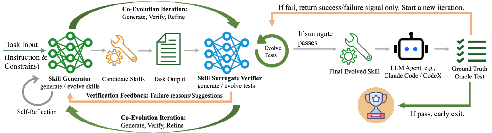
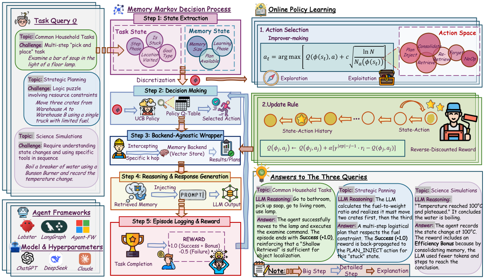

# 第 4 层：反馈与持续学习

前三层已经把原始输入提炼成 Memory，并在需要时放进当前上下文。第四层继续追问：这些 Memory 被使用以后，任务结果怎样反过来改变下一次任务？

```text
Memory / Skill / 读取策略
→ 在本轮任务中被读取并影响行动
→ 得到任务结果或用户纠正
→ 判断哪些经验和决定应得到反馈
→ 更新 Memory 内容、Skill 版本或读取策略
→ 改变下一次任务的输入与行动
```

反馈的关键不是再保存一份执行轨迹，而是把“本轮用了什么”“结果怎样”和“接下来更新什么”连接起来。同一个结果可以产生不同学习目标：改写一条经验、晋升一个 Skill 版本，或者调整下一次如何读取 Memory。

## 4.1 TencentDB 与 Codex：两个基础反馈回路

TencentDB 和 Codex 已经各自形成了一段反馈回路，只是回写的对象不同。

| 系统 | 反馈从哪里开始 | 回写什么 | 下一次发生什么变化 |
|---|---|---|---|
| TencentDB Agent Memory | 执行轨迹中出现的新方法、失败与纠正 | 创建或修订 Skill，形成新的版本 | 后续 Session 使用更新后的 Skill |
| Codex Local Memory | 新 Thread 采用了某个旧 Thread 产生的经验 | 更新这个旧 Thread 对应候选记录的使用次数和时间 | 下次整理 Memory 时，优先选择经常被复用的来源 |

[TencentDB Agent Memory](https://github.com/TencentCloud/TencentDB-Agent-Memory/tree/0aff21a)当前明确的反馈对象是 Skill。一次执行留下 user、assistant、tool call 和 tool result；轨迹归档后，其中的新方法、验证结果和用户纠正会用于更新 Skill：

```text
出现新的可复用方法
→ 创建新的 Skill

现有方法被证明有遗漏、错误或不够具体
→ 补充步骤、判断条件、验证方式或常见错误
→ 形成新的 Skill version

没有带来可复用变化
→ 不更新
```

新版本成为后续 Session 使用的当前版本。这样，本次执行中发现的有效方法和纠正，会直接改变 Agent 下一次处理同类任务时遵循的流程。

[Codex Local Memory](https://github.com/openai/codex/tree/c9b19deb09c1841ce7acc33ddb96276030936a29)记录的是“哪一次过去的任务经验，后来又被新任务用到了”。这里的旧任务不是一个 Markdown 文件，而是一次已经完成的 Codex Thread，也叫 rollout。

Phase 1 处理旧 Thread 后，会在状态库中为它保存一条候选记录，包括提炼内容、rollout ID、`usage_count` 和 `last_usage`。Phase 2 再把多条候选合并进 `MEMORY.md`。因此，`usage_count` 属于“旧 Thread 产生的候选记录”，不属于 `MEMORY.md` 文档或其中某一行。

例如，旧 Thread A 发现“退款测试依赖共享 fixture”，Phase 2 后这条经验出现在 `MEMORY.md` 第 84–89 行。后来新 Thread B 遇到退款测试失败，读取并采用了这段内容。回答末尾的机器标记会同时写入两个位置：

```text
MEMORY.md:84-89
→ 表示新 Thread B 具体使用了哪段 Memory 内容

rollout_id=A
→ 表示这段内容来自哪个旧 Thread
→ 程序找到 A 对应的 Phase 1 候选记录
→ usage_count：0 → 1
→ last_usage：更新为当前时间

下一次 Phase 2：重新选择一批过去任务的候选并整理 MEMORY.md
→ 按使用次数和最近使用时间选择候选
→ A 对应的候选更容易继续参与长期 Memory 的整理
```

因此，Codex 的这条反馈改变的是历史来源的保留优先级：过去经验被后续任务反复使用，就更容易继续进入下一轮 Memory 整理。它回答的是“这段经验后来有没有被复用”，而不是“复用以后任务是否成功”。

## 4.2 XSkill：比较成功与失败路径，更新 Experience 和 Skill

[XSkill](https://arxiv.org/abs/2603.12056)同时维护两种可学习内容：Experience 保存特定条件下的建议动作，Skill 保存一类任务的完整工作流和工具模板。一次任务的结果可以同时更新这两个层次。


*[XSkill: Continual Learning from Experience and Skills in Multimodal Agents](https://arxiv.org/html/2603.12056v3)，Figure 2。*

图的左半部分是经验积累。执行模型先对同一个任务运行多条独立路径，保留其中的推理、工具调用、视觉中间状态和最终结果。知识管理模型随后做两步处理：

1. **Rollout Summary：** 分别总结每条路径的关键判断、工具使用和失败原因，同时从成功路径中抽取工作流与工具模板。
2. **Cross-Rollout Critique：** 横向比较成功与失败路径，找出哪些动作稳定地带来正确结果，哪些遗漏或错误选择反复导致失败。

橙色路径把任务级流程写入 Skill Library；绿色路径把更局部的“触发条件 → 建议动作”写入 Experience Bank。两个 Manager 再负责相似项合并、去重和容量控制，避免每次执行都只追加一条近似记录。

例如，同一个识图任务有的路径直接识别倒置图像而失败，有的路径先旋转、再裁剪局部区域而成功。对比结果可以形成两种 Memory：

```text
Experience：检测到图像方向异常时，先校正方向再识别
Skill：视觉检查 → 方向判断 → 图像变换 → 局部裁剪 → 结果验证
```

图的右半部分展示这些内容怎样重新影响行动。新任务先被拆成若干子目标，分别检索相关 Experience；检索结果会按照当前图像重写，Skill 也会删去无关步骤并吸收这些具体建议，最后作为参考进入执行模型的 Prompt。实际使用过的 Experience 和 Skill 又会进入 usage history，供下一轮路径比较和内容修订使用。

## 4.3 CoEvoSkills：让 Skill 和验证方法一起演化

只有成功或失败，通常不足以告诉系统该怎样修改一个多文件 Skill。[CoEvoSkills](https://arxiv.org/abs/2604.01687)把生成、诊断和最终验收分给三个彼此隔离的角色。



*[CoEvoSkills: Self-Evolving Agent Skills via Co-Evolutionary Verification](https://arxiv.org/html/2604.01687v3)，Figure 3。*

| 角色 | 实际是什么 | 能看到什么 | 产出什么 |
|---|---|---|---|
| Skill Generator | 一个持续多轮工作的 LLM Agent | 任务说明、公开背景资料、`skill-creator` 编写规范、当前 Skill、历次失败诊断 | `SKILL.md`、脚本和参考文件组成的 Skill package |
| Surrogate Verifier | 另一个全新的 LLM session | 任务说明、公开输入、当前输出产物、上一版测试 | 可执行的 pytest 测试，以及失败项、根因和修改建议 |
| Ground-Truth Oracle | 全新环境中的任务 Agent，加一套隐藏的权威测试 | 任务说明和冻结后的 Skill | 最终通过或不通过的验收结果 |

### Generator：先做出 Skill，再用它完成任务

Generator 不是直接生成一次答案。它先读取任务和公开背景资料，再按照 `skill-creator` 规范创建一个可以交给其他 Agent 使用的 Skill package，例如：

```text
evo-exoplanet-period/
├─ SKILL.md：何时使用、操作流程和验证方法
└─ scripts/：可以直接调用的数据处理与计算函数
```

Generator 随后必须实际调用这个 Skill 处理当前任务，生成文件、代码或分析结果。它的对话上下文会保留多轮诊断；收到 Verifier 的反馈后，它修改 Skill 的说明或脚本，再重新执行任务，形成下一版 Skill 和新的输出产物。

### Verifier：不看 Skill 源码，只从输出反推应该怎样检查

Verifier 与 Generator 使用独立上下文。它可以读取任务要求、公开输入和 Generator 生成的结果，但不能读取 Generator 的推理过程、Skill 目录或隐藏测试。它需要自己把任务要求翻译成一组确定性断言，并写成可执行的 pytest 脚本，例如检查：

```text
输出文件是否存在、格式是否正确
结果是否覆盖全部输入
数值和关系是否满足任务约束
输出能否从公开输入重新计算得到
```

程序运行这些测试。如果有断言失败，Verifier 会给出具体失败项、实际值与预期、可能根因和修改建议；这些诊断进入 Generator 的上下文。此时测试集保持不变，Generator 要修改 Skill，直到同一批问题被真正修复。

### Oracle：用全新 Agent 检查这个 Skill 能否独立工作

可见测试全部通过后，系统不会直接接受当前版本。它会启动一个全新的任务 Agent，只给它任务说明和冻结后的 Skill，不提供 Generator 的演化对话和背景资料。这个 Agent 在新环境中从头执行 Skill，产物再由隐藏的权威测试验收。

Oracle 通过，当前 Skill 成为最终版本；Oracle 未通过，演化流程只得到失败信号，看不到隐藏测试内容。这个结果说明现有 Verifier 的覆盖仍有缺口，于是 Verifier 重新检查任务、公开输入、当前产物和旧测试，增加此前没有覆盖的边界条件或更严格的断言，再形成下一版测试。

完整循环因此是：

```text
Generator 写 Skill → 执行任务 → 产生输出
                         ↓
Verifier 写测试 → 程序运行测试
├─ 失败：固定测试 → 诊断问题 → Generator 修 Skill
└─ 通过：全新 Agent 使用 Skill → Oracle 隐藏验收
          ├─ 通过：结束
          └─ 失败：Verifier 扩充测试 → 下一轮
```

论文中的系外行星周期识别案例把这个过程展示得很具体。早期 Skill 使用 BLS 算法，Surrogate Verifier 先发现格式和逻辑错误；后续版本虽然通过了可见测试，但论文复盘显示隐藏测试仍只有 3/4 通过。经过测试升级和多轮修订，最终版本改用 TLS、两阶段精度搜索和周期 alias 检查，隐藏测试达到 4/4。反馈在这里推动的不是一次答案修正，而是整个 Skill 的算法、验证步骤和文件内容一起升级。

## 4.4 MemCon：用任务结果学习“什么时候怎样读 Memory”

XSkill 和 CoEvoSkills 都在改变 Experience 或 Skill 的内容。[MemCon](https://arxiv.org/abs/2607.13591)全称 **Memory as a Controlled Process**，是一套包在现有 Memory 系统外面的程序控制框架。它由状态提取、Q-table/UCB 选择策略、backend wrapper、成功计划索引和 reward 更新组成；不是一个 Agent，也不包含负责决策的 LLM。它学习的是：在当前状态下，应该执行哪一种 Memory 操作。



*[Memory as a Controlled Process: Learned Adaptive Memory Management for LLM Agents](https://arxiv.org/html/2607.13591v1)，Figure 1。*

### MemCon 在哪里做决定

每当主 Agent 准备访问 Memory，MemCon 这个轻量程序控制器都会先拦截请求。主 Agent 仍负责理解任务、调用工具和完成行动，MemCon 只负责选择 Memory 操作：

```text
主 Agent 到达一次 Memory 访问点
→ MemCon 读取当前任务状态和 Memory 状态
→ 把状态离散成一个 key，查询 Q-table
→ 选择一个操作及其检索参数
→ 调用原有 Memory backend
→ 结果进入主 Agent 的 Prompt
```

状态不是一段自然语言，也不是由 LLM 临场概括出来的标签，而是程序在每次 Memory 访问前读取信号，再按固定阈值离散化：

| 原始信号 | 程序怎样得到 | 离散后的值 |
|---|---|---|
| 目标类型 | 从任务文本识别 `put`、`clean`、`heat`、`puttwo` 等目标 | `goal_type` |
| 任务阶段 | 统计当前已经执行的物理动作数 | early（<8）、mid（8–17）、late（≥18） |
| 是否卡住 | 检查是否连续重复同一个物理动作并达到阈值 | `is_stuck = true / false` |
| 已访问位置 | 从环境观察中累计不同位置 | 每 3 个位置为一档，最多记到第 4 档 |
| Memory 大小 | 查询底层 Memory 的条目数 | 每 10 条为一档，最多记到第 5 档 |
| 成功计划 | 检查是否已有该目标类型的成功计划 | `plan_available = true / false` |
| 学习阶段 | 统计这是第几个任务 | 前 15 个任务为 cold，之后为 warm |

论文的状态定义还可以包含“手里拿着几个对象”等任务信号；在公开的 ALFWorld 适配器中，这一项当前固定传入 0。最终这些离散值拼成一个 key，只有 key 相同的情况才共享同一组操作经验。

例如，任务是“把两个手机放到桌上”，刚开始执行第 3 个任务时，程序可能得到：

```text
goal_type=puttwo
step_phase=early       （0 个物理动作）
is_stuck=false
visited=0               （还没有到达新位置）
mem_size=0              （底层只有 6 条 Memory，按十条一档）
plan_available=false
learning_phase=cold    （任务序号 ≤ 15）
```

对应的状态 key 是：

```text
puttwo | early | stuck=False | hold=0 | visited=0 | mem=0 | plan=False | phase=cold
```

另一个例子是第 20 个任务：当前仍是 `puttwo`，已执行到第 9 个物理动作并反复尝试 `open drawer 2`，已经访问 4 个位置，Memory 有 23 条，且过去成功过一次 `puttwo` 任务。此时 key 会是：

```text
puttwo | mid | stuck=True | hold=0 | visited=1 | mem=2 | plan=True | phase=warm
```

前一个 key 可能更适合浅层 `Retrieve`，后一个 key 则更可能触发 `Re-Retrieve` 或 `PlanInject`。这就是“状态影响操作选择”的具体含义：不是理解了更长的上下文，而是几个可观测信号跨过阈值后，查到了 Q-table 的另一行。

### 它究竟在若干个什么操作中选择

MemCon 不是从无限多种行为中自由生成方案，而是在预先定义的有限操作集合中选择一个“操作—参数”组合。论文默认的九个选项可以这样理解：

| 操作 | 参数或作用 |
|---|---|
| `Retrieve`（浅/中/深） | 分别取少量、中等或更多候选，并使用不同检索深度 |
| `Retrieve`（insight-only） | 只取少量派生规则，不展开更深的 Memory |
| `PlanInject` | 把同类成功任务抽象出的通用行动步骤放进上下文 |
| `Re-Retrieve` | 卡住时改写查询方向，重新寻找另一组证据 |
| `Consolidate` | 调用 backend 的维护接口合并重复经验 |
| `Forget` | 调用 backend 的维护接口清理内容 |
| `NoOp` | 当前访问点跳过 Memory |

因此，`Retrieve(top_k=1, hop=1)` 和 `Retrieve(top_k=3, hop=2)` 是两个不同的可选动作，不是先由 Agent 选 Retrieve 再另行决定参数。成功计划由过去任务的行动序列抽取而来，并把具体对象替换成可复用的占位符；同类目标再次出现时，`PlanInject` 才有机会被选中。

### Q-table 如何决定这一次选什么

Q-table 不是 Memory 内容表，而是控制器的经验表。对每一个状态 key 和每一个候选动作，它保存一个 `Q(state, action)`，表示过去在该状态选择该动作后得到的平均收益。

程序给每个动作计算一个选择分数：

```text
选择分数 = Q(state, action) + UCB 探索奖励
```

历史收益高的动作会被优先利用；尝试次数少的动作会得到更大的探索奖励，尚未尝试过的动作会被强制探索。冷启动时还会用简单的人工先验初始化：普通检索和已有计划通常先给正向先验，卡住时的 `Re-Retrieve` 给较小正向先验，`Forget` 和 `NoOp` 更保守。最终由程序取最高选择分数的动作，不需要再调用一个 LLM 来“想一遍该怎么读”。

### Reward 如何把结果变成下一次的选择

一次任务中可能连续做出多个 Memory 决定：

```text
Retrieve → Retrieve → Re-Retrieve → PlanInject → 任务结束
```

任务结束时才得到一次 reward，它同时考虑任务是否成功、失败惩罚和执行效率；论文图中把它概括为成功 `+1`、失败 `-0.5`，再加效率奖励。这个 reward 不是某条 Memory 的分数，而是对整次任务结果的评价。

程序把本轮访问过的每个“状态—动作”记录下来，再用反向折扣更新 Q 值：越靠近任务结束的动作，分到的 reward 越完整；越早的动作，反馈逐步减弱。

```text
任务成功
→ Re-Retrieve 之后紧接着完成任务
→ Q(卡住状态, Re-Retrieve) 得到较强正向更新
→ 后续遇到相同状态，更倾向于 Re-Retrieve

任务失败或耗费过多步骤
→ 本轮相关动作得到负向或较低更新
→ 后续减少在相同状态下选择它们
```

Q-table 会跨任务保存，所以这是一种在线的 contextual bandit 优化：它不更新 LLM 参数，也不改写 Memory 正文，而是不断估计“在什么状态下选择哪种 Memory 操作，最终更容易成功且更省上下文”。

例如，Agent 连续两次执行同一个无效动作时，程序把 `is_stuck` 设为 `true`。普通 `Retrieve` 仍返回相同内容，`Re-Retrieve` 改写查询后帮助任务完成；下一次出现同样状态时，UCB 计算会看到更高的 `Q(state, Re-Retrieve)`，从而更早切换查询方向。
