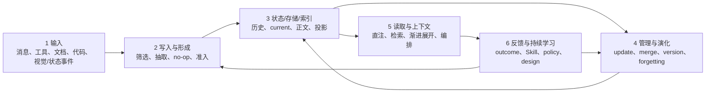

# Agent Memory 六层总览：从真实经历到持续学习

**证据截止：2026-08-25**

Agent Memory 不是“把聊天存进向量库”。一套可追溯的系统至少要说明：原始经历是什么，怎样形成长期对象，正文和索引放在哪里，新证据怎样更新旧状态，各种 Memory 怎样进入上下文，以及使用结果怎样反过来改变经验、Skill 或管理策略。

本报告以 [TencentDB Agent Memory `0aff21a`](https://github.com/TencentCloud/TencentDB-Agent-Memory/tree/0aff21a)和 [OpenAI Codex `c9b19deb`](https://github.com/openai/codex/tree/c9b19deb09c1841ce7acc33ddb96276030936a29)的固定实现为工程主线，再把近期论文与仓库放回它们真正改变的层。

## 六层数据流



Skill 贯穿四个阶段：首次形成在第 2 层，版本更新在第 4 层，按需读取在第 5 层，使用结果驱动的改进在第 6 层。

## 六层各自回答什么

| 层 | 核心问题 | TencentDB 的实现锚点 | Codex 的实现锚点 | 近期具体案例 |
|---|---|---|---|---|
| [1 输入](01-input.md) | 系统实际收到什么原料？ | Chat L0、Skill 轨迹、Wiki 文档、CodeGraph 仓库 | Thread/rollout 事件与 cwd/branch/commit | XSkill 视觉观察、WorldLines 状态变化、Computer History 事件流 |
| [2 写入与形成](02-write-formation.md) | 什么值得第一次写成长期对象？ | L0→L1→L2→L3；轨迹 Review→Skill | Phase 1 candidate；Phase 2 Memory/Skill 文件 | MemTxn source-supported admission |
| [3 状态、存储与索引](03-state-storage-indexing.md) | 正文、历史、current 和索引各在哪里？ | JSONL/Markdown/DB/FTS/vector/graph；Wiki/CodeGraph | rollout/state DB/memories DB/Markdown/Git baseline | 双时间版本图 |
| [4 管理与演化](04-management-evolution.md) | 新证据怎样修正已有状态？ | L1/L2/L3 update/merge；Skill immutable versions | Phase 2 文件级改写与 supersede | MemTxn、GEM/MemState、Control-Plane Placement/ForgetEval |
| [5 读取与上下文](05-retrieval-context.md) | 每种 Memory 怎样进入当前上下文？ | L3 直注；L2 导航→正文；L1/L0、Skill/Wiki/CodeGraph 工具路径 | summary 直注；`MEMORY.md` 词法 search/read；来源下钻 | MemFlow、OpenViking、CICL |
| [6 反馈、经验与持续学习](06-feedback-learning.md) | 使用结果怎样变成更好的经验、策略或设计？ | 轨迹 Review→Skill version（短闭环） | citation→usage→Phase 2 selection（短闭环） | XSkill、Trace2Skill、CoEvoSkills、MemSkill、MemCon、AFTER、ALMA、Causal Memory/Omri |

## 两套工程主线不是同一个产品词典

### TencentDB：显式对象层级与多资产读取

TencentDB 的 Chat 路径把 user/assistant 消息写为 L0，再抽成可独立检索的 L1；多个 L1 形成 Scene Markdown，多个 Scene 形成直接注入的 Persona。Skill 另从完整工具轨迹形成版本链；Wiki 和 CodeGraph 分别处理外部文档与代码结构。

```text
messages → L0 → L1 atomic memory → L2 scene → L3 persona
tool trajectory → Review → versioned SKILL.md
documents → Wiki pages + FTS/Wikilinks
repository → files/symbols/call edges
```

读取也按对象分层：L3 全文在新 Session 直接生效；L2 只先给 path/summary；L1/L0 通过工具检索；Skill、Wiki、CodeGraph 先暴露目录与工具，再按需取正文或关系。它的具体性来自对象、Prompt、版本和读取路径都可以分别指出。

### Codex：两阶段形成与文件化渐进读取

Codex 先把历史任务保存为 rollout。后台 Phase 1 对单条 rollout 输出严格三字段候选，Phase 2 再把有界候选集合、旧文件和 Git diff 整理成全局 Markdown 工作区。

```text
rollout JSONL
→ Phase 1：rollout_summary / slug / raw_memory 或 no-op
→ memories_1.sqlite.stage1_outputs
→ Phase 2：raw candidates + old files + diff
→ memory_summary.md / MEMORY.md / rollout_summaries / skills
→ 新 Thread：summary 直注 + 文件词法 search/read
→ citation → usage_count / last_usage → 下一轮 selection
```

Codex 的 Phase 1 不是可直接搜索的长期 Memory；只有 Phase 2 文件化以后，未来 Thread 才能使用。读取端没有预建 embedding/ANN，而依赖短索引、普通文本关键词、行号和来源指针逐层展开。

## 一条规则怎样走完六层

以“修复缺陷前先写失败测试；纯重构先建立行为基线”为例：

1. **输入：** Session A 的用户约定、Agent 回复和测试工具结果，与 Session B 的纠正，分别保留身份、项目和时间。
2. **形成：** TencentDB 形成两个 L1、更新 Scene 并产出 Persona；Codex Phase 1 先产生两个 rollout candidates，Phase 2 再合并成一段条件规则。
3. **状态：** TencentDB 的 L1 历史/current/索引与 L2/L3 Markdown 分开；Codex 的原始 rollout、candidate DB、正式 Markdown 和 Git baseline 分开。
4. **管理：** 新证据不是简单追加。TencentDB 的 L1 update/merge 触发 L2/L3 改写；Codex Phase 2 重写当前文件。MemTxn 会先验证新 clause 的来源，再由 Temporal Resolver 切换 current version；GEM/MemState 会进一步追踪哪些派生对象需要重算。
5. **读取：** TencentDB L3 直接提供规则，相关 Scene/原话按需展开；Codex summary 指向 `MEMORY.md`，需要证据时再读 rollout summary 与原始 JSONL。
6. **反馈：** 一次新任务的测试结果可以成为下一版 Skill 的证据。XSkill 用多路径 outcome 对照，Trace2Skill 把多条局部 patch 合成 Skill，CoEvoSkills 让 Generator 与 Verifier 迭代，MemCon 则学习下一次该检索、重检索还是 no-op。

这个例子显示“形成一段文字”只是中段。真正困难的是来源支持、条件修正、派生传播、上下文落位和结果归因。

## 当前成熟与前沿的分界

两套固定仓库已经清楚实现：

- 持久化真实消息、工具轨迹与项目定位；
- 由 Prompt 驱动的候选抽取、no-op、去重与跨经历巩固；
- JSONL/DB/Markdown/索引的分工；
- L1/L2/L3 或 Phase 2 的持续改写；
- 直接注入、工具检索和文档渐进披露；
- Skill 版本或 citation usage 的短反馈链。

近期研究仍在补三个关键缺口：

- **更新能否被验证和恢复：** MemTxn 把 source check、Temporal Resolver 与 snapshot journal 外置；GEM/MemState 把正确性提升到 state trajectory 与派生关系。
- **上下文能否按任务组织：** MemFlow 显式选择路由和预算；OpenViking 统一 URI、目录递归和 L0/L1/L2 hydration；CICL 按下一步行动影响选择证据。
- **反馈能否真正带来迁移：** XSkill/Trace2Skill/CoEvoSkills 形成不同 Skill 学习循环，MemSkill/MemCon 学习 Memory operation，AFTER 测跨任务/角色/模型迁移，ALMA 搜索 Memory design，Causal Memory 与 Omri 把 outcome 与系统成本变成可观察对象。

## 阅读路径

第一次阅读可按六层顺序进入：

1. [输入](01-input.md)与[写入形成](02-write-formation.md)：先看真实事件怎样变成长期对象；
2. [状态存储](03-state-storage-indexing.md)与[管理演化](04-management-evolution.md)：再分清正文、索引、版本和语义遗忘；
3. [读取上下文](05-retrieval-context.md)：逐 Memory 路径看它怎样进入 Prompt；
4. [反馈与持续学习](06-feedback-learning.md)：最后看具体论文/仓库怎样把结果变成 Experience、Skill、policy 或 design。

需要从一条固定工程链端到端理解 Codex，可继续读 [Codex Local Memory 完整说明](codex-complete.md)。
