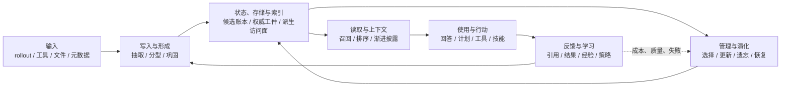

# 总览与通用架构：一条从经历到行动的七层链路

**证据截止：2026-08-25**

## 一图看懂：先看整条链路

Agent 在跨会话工作时，需要把过去的任务、工具结果、项目状态和用户纠正带到后续任务。公开的 Codex Memory 实现提供了一条可以直接观察的工程链路：历史 rollout 先进入候选处理，随后由两个阶段的模型和状态库形成可读文件，新的 root session 再按需读取这些文件，最终回答中的 citation 又回写使用信号。

从这条实现可以抽出七层：



这张图是对公开实现的描述性抽象。具体系统会合并、跳过或替换其中的模块。Codex 的输入和形成较完整，状态与文件访问有明确边界，语义冲突、项目硬隔离、派生删除和长期反馈仍有明显缺口。近期论文和仓库主要在这些缺口上增加控制面、状态操作和策略学习。

## 领域现在主要在做什么

下面的七层表和数据流，是本报告的通用架构入口。

## 七层各自负责什么

| 层 | 当前系统要完成的工作 | Codex 中可以看到的形状 | 近期推进的方向 |
|---|---|---|---|
| 输入 | 选择哪些运行记录进入 Memory 流程，保留必要上下文和来源 | root session 启动、rollout eligibility、过滤、脱敏、上下文预算 | ingestion 独立计量、来源回执、时间/主体/用途信息 |
| 写入与形成 | 从运行材料生成候选事实、事件、偏好、项目知识或技能 | Phase 1 逐 rollout 抽取，Phase 2 全局巩固 | source-supported write、类型化候选、学习型操作策略 |
| 状态/存储/索引 | 保存候选、权威状态和访问投影 | `memories_1.sqlite`、Markdown 工件、Git baseline、关键词访问 | 状态轨迹、版本/时间、图关系、策略和多路索引 |
| 管理与演化 | 选择、更新、巩固、遗忘、撤销、恢复和重建 | usage/recency 选择、ad-hoc note、污染清理、reset | 事务提交、冲突保留、级联修复、可验证删除 |
| 读取与上下文 | 找到与当前任务相关且允许使用的内容，并压缩成上下文 | 2500-token summary、`MEMORY.md` 词法搜索、按需读取 rollout/skills | 多路召回、主动检索、预算感知和 action-aware retrieval |
| 使用与行动 | 让记忆影响回答、计划、工具参数、技能和协作 | read-path instructions、只读 Memory root、citation | 记忆到行动的门控、技能适用条件、环境和权限重新检查 |
| 反馈与学习 | 根据使用、结果和纠正更新保留、形成和策略 | citation 回写 `usage_count`/`last_usage`，触发后续 Phase 2 | 操作级奖励、经验晋升、长期评测、反自强化和恢复反馈 |

这七层回答的是不同问题。把它们合成一个“记忆库”会掩盖很多实际故障：输入阶段漏掉证据，写入阶段把推断当事实，索引阶段落后，读取阶段越权，使用阶段把旧技能直接用于新环境，反馈阶段又把一次偶然成功变成长期偏好。

## 第一次遇到这些词，可以这样理解

| 术语 | 白话解释 | 在 Codex 里对应什么 |
|---|---|---|
| rollout | 一次完整任务的运行记录 | 线程 JSONL，包含消息、工具调用和结果 |
| Phase 1 | 每个任务先做一份候选摘要 | 逐 rollout 的模型抽取 |
| Phase 2 | 把多份候选整理成长期手册 | 全局巩固 Agent 更新 Markdown 工件 |
| candidate | 等待判断的记忆草稿 | `stage1_outputs` 中的一行 |
| lease | 某个后台 worker 暂时拥有处理权 | 防止两个 worker 同时处理同一 job |
| watermark | “处理到哪一批输入”的位置标记 | source/job 更新水位 |
| authoritative state | 系统愿意当作当前状态的那份记录 | Codex 的可读 Markdown 工件及其 Git baseline |
| derived index | 为了更快找到内容而生成的访问投影 | summary、标题、关键词和行号组织 |
| scope | 这条内容属于谁、哪个项目、哪段时间 | cwd、branch、thread、user 等线索 |
| citation / usage | Agent 说自己用了哪条 Memory，以及系统记录这次使用 | rollout ID、文件行号、`usage_count`、`last_usage` |
| embedding / ANN | 把文字变成向量，再找距离近的候选 | Codex 当前本地读取没有使用的检索路线 |
| TTL | 到期后自动失效或清理的时间 | 一些外部 Memory 服务给 episodic 状态设置的保留期 |

后面的章节会在具体数据流中再次解释这些词。读者不需要先学习数据库或机器学习术语，先跟着“输入了什么、写到哪里、怎样读出、怎样影响行动”走即可。

## Codex 提供的成熟工程起点

Codex 的当前仓库文档把 Memory pipeline 组织成两个后台阶段。root session 启动时，系统检查 feature、session 类型和 state DB，然后异步执行 Phase 1 与 Phase 2。Phase 1 从 state DB 选择符合年龄、空闲、来源和租约条件的 rollout，生成 `raw_memory`、`rollout_summary` 和可选 slug，并把结果保存为 stage-1 数据。Phase 2 取有界的 stage-1 集合，同步 `raw_memories.md` 和 `rollout_summaries/`，再由受限的巩固 Agent 更新 `MEMORY.md`、`memory_summary.md` 和 `skills/`。[官方 pipeline 说明](https://github.com/openai/codex/blob/main/codex-rs/memories/README.md)

可以把它压缩成下面的工程图：

```text
近期空闲 root rollout
  ↓
Phase 1：逐 rollout 模型抽取
  ↓
memories_1.sqlite：候选、job、lease、watermark、usage
  ↓
Phase 2：全局受限 Agent 巩固
  ↓
~/.codex/memories/
  ├─ memory_summary.md       常驻导航摘要
  ├─ MEMORY.md               关键词可查的手册
  ├─ rollout_summaries/      逐任务摘要
  └─ skills/                 可复用流程
  ↓
新 session 读取、回答、工具行动
  ↓
citation 解析 → usage 回写 → 下一轮选择
```

这套形状有三个值得保留的架构判断：

1. 候选账本和最终可读状态分开。SQLite 记录处理进度、候选和调度；Markdown 工件承担 Agent 实际读取的内容。
2. 形成和读取采用不同策略。写入端使用模型做抽取和巩固，读取端使用常驻摘要、关键词扫描和渐进披露。当前 Codex 的本地搜索实现没有 embedding 或 ANN，访问质量更多依赖摘要标题、关键词和路径组织。
3. Memory 影响上下文，不直接绕过行动权限。主 Agent 仍受当前 sandbox、approval 和工具权限控制；Guardian review session 还会明确关闭 Memory 读取。

## 当前工程中“向量检索”处于什么位置

向量检索仍是很多外部 Memory 服务的访问面，但它只解决候选发现的一部分。Codex 的实现展示了另一条成熟路径：短摘要常驻、文件关键词搜索、按需打开详细摘要和原始 rollout。它牺牲了语义召回的宽度，换来低运行成本、可解释路径和容易引用的行号。

近期系统研究开始把 construction、retrieval 和 generation 分开计量。Omri 等人的 [Agent Memory: Characterization and System Implications of Stateful Long-Horizon Workloads](https://arxiv.org/abs/2606.06448) 对十类系统进行阶段化分析，指出抽取型和 agentic 记忆会把成本搬到构造阶段，并讨论构造调度、查询量摊销和新鲜度/延迟权衡。这个结果支持“检索器只是整条链路的一段”的判断，不能推出某种访问方式普遍优于其他方式。

AgeMem v3（2026-07-23）的论文把 store、retrieve、update、summarize、discard 暴露为 Agent policy 可以调用的动作，尝试让读取和管理随任务变化。它代表主动操作路线，仍属于研究原型，不能直接替代 Codex 已有的文件化读取路径。[AgeMem v3](https://arxiv.org/abs/2601.01885v3)

## 最近半年，架构变化集中在哪里

近期工作没有形成一个取代 Codex 的统一架构。变化主要落在以下几条线上：

- **输入开始携带更多控制信息。** 来源、版本、有效时间、主体和用途逐渐进入状态边界，减少后续层靠模型猜测。
- **写入开始有准入和提交。** MemTxn 在回答模型之外增加 source-supported update、时间版本选择和快照恢复；它把写入错误当作需要审计和恢复的状态变化。[MemTxn](https://arxiv.org/abs/2607.27834)
- **状态正确性从单条记录扩展到轨迹。** GEM/MemState 把 ingestion、revision、forgetting、retrieval 视为状态级操作，用 typed dependencies 和 declarative policies 讨论演化正确性；原型验证了可行性，尚未成为通用运行时。[GEM / MemState](https://arxiv.org/abs/2605.26252)
- **读取和行动逐渐连接。** 近期工作开始检查检索内容能否在当前工具版本、权限和环境中驱动行动，同时测量问答命中。
- **反馈信号变得更具体。** citation、成功/失败、用户纠正、成本和恢复结果都可能影响下一轮保留或操作选择。

这些变化会在七个章节中分别展开。每章只保留能改变实现理解的论文、官方文档或仓库，不把新名词单独列成新闻目录。

## 近期材料怎样标注

正文首次引用近期材料时，会同时写出日期和证据身份：

| 标识 | 例子 | 正文中的含义 |
|---|---|---|
| 官方工程 | OpenAI Codex、Microsoft Agent Framework、LangGraph、Neo4j Labs | 可以检查代码/README 的实现路径；不能单凭仓库证明质量或生产采用 |
| 论文/预印本 | Omri 等（2026-06-04）、Orogat & Mansour（2026-05-25）、Li 等（2026-07-27）、Cui 等（2026-07-30） | 解释作者提出的机制和作者协议下的结果；预印本不写成行业标准 |
| 公开 issue | Codex #26684、#38860 等 | 问题报告或需求线索；不转换成发生率 |

仓库的 Star 只参与低关注噪声筛选，正文判断依靠组织身份、固定版本、代码/文档可读性和机制是否清楚。

## 当前可以看懂的成熟部分

以 Codex 这类公开 runtime 为基准，以下能力已经有比较清楚的工程形状：

- 持久化线程和 rollout 作为来源；
- 后台 job、租约、重试和 watermark；
- 两阶段抽取与全局巩固；
- 候选数据库和可读文件工件分层；
- 常驻摘要与渐进读取；
- 路径、symlink、网络和工具权限控制；
- citation 与 usage 的可观察回写。

以下能力仍缺少跨系统、跨任务的充分证据：

- 事实和冲突的语义正确性；
- project/worktree 的硬作用域；
- 一条 forget 如何清理摘要、索引、缓存和行为影响；
- 生成式巩固的可验证提交；
- 经验和技能在不同模型、工具版本和任务之间的安全迁移；
- 从输入一直到工具行动的统一长期评测。

## 当前形成的共识、分歧与空白

### 相对稳固的共识

- Agent Memory 需要持续保存、更新和读取跨会话状态；单个向量库或单段摘要无法说明完整生命周期。
- 原始来源、候选状态、可读视图和行动权限应能被区分；Codex 的 rollout、SQLite 和 Markdown 分层给出了一个公开工程例子。
- Memory 的收益必须和写入、巩固、检索、上下文和恢复成本一起观察。

### 主要分歧

- 形成应更多依赖原始轨迹、结构化事实、模型摘要，还是让 Agent 主动调用管理操作；
- 词法、BM25、向量、图和主动检索怎样组合，才能在不同任务预算下保持稳定；
- usage、任务结果和用户纠正怎样共同决定保留和技能晋升。

### 仍待解决的空白

- 逐项修订、撤回和派生删除缺少跨实现一致语义；
- 项目、worktree、用户和团队作用域仍常依靠应用层约定；
- 从 Memory 读取到高风险工具行动的长期、可复现评测仍少；
- 论文原型提出的事务、来源链和行动门控尚未形成普遍 runtime 接口。

后续章节会把这些判断落实到实际文件、论文机制、工程数据流和限制，而不再单独展开抽象分类史。
