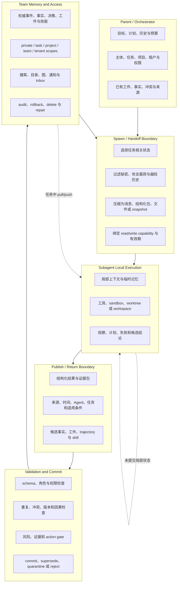

# Subagent Memory 一般架构：继承、局部工作与可信提交

**当前版本：Round 01 Pilot。此模型是描述性解剖图，不是推荐组合。**

## 1. 状态不是一个池，而是三个权威层

一个可解释的 Subagent 系统通常至少涉及三种状态：

1. **Parent/Orchestrator state**：任务目标、计划、预算、工具、权限、已有证据与团队视图；
2. **Child-local state**：某个 Subagent 在一次调用或持续实例中的观察、scratchpad、临时记忆、workspace 和未验证结论；
3. **Team authoritative state**：已经通过范围、来源、冲突与提交规则，允许 Parent、Sibling 或未来 Agent 依赖的状态。

三者可能物理上共用数据库或文件系统，但逻辑语义不同。Child 能写入一个共享表，不表示该行已经成为团队真相；Parent 能看到完整历史，也不表示每个 Subagent 都有权继承。

## 2. 完整数据流

## 3. Spawn 边界的四个决定

### 3.1 调用语义

Handoff、agent-as-tool、并行 worker 和持续 Agent 并不等价。Handoff 可能切换 active agent 并延续一次 run；agent-as-tool 通常让 manager 保持最终控制；并行 worker 需要结果 join；持续 Agent 还拥有独立的跨任务状态。调用语义决定谁拥有 session history、谁负责最终提交，以及 Child 是否能继续看到 Parent 的后续变化。

### 3.2 状态选择

最简单的系统复制整段 transcript。更受控的系统生成 task packet：目标、完成标准、允许工具、输入工件、已知事实、冲突和禁止项。选择器可以是规则、模型或二者组合。规则可预测但难处理开放任务；模型能压缩，却可能把推断写成事实或漏掉决定性细节。

### 3.3 隔离方式

隔离既包括文本，也包括 workspace、credentials、network、tools 和 memory writer。Child 可以共享只读仓库但使用独立 worktree，可以读取团队记忆却没有写权限，也可以在 sandbox 内产生候选文件，由 Parent 在外部审查。文本过滤无法替代资源与能力隔离。

### 3.4 同步模式

Spawn 后，Child 可以拿到静态 snapshot，也可以订阅 Parent/Team 更新。静态视图可重放但会陈旧；实时共享能反映变化，却会引入 race、非确定性和额外上下文噪声。

## 4. Child 局部状态

Child-local memory 适合保存尚未稳定的假设、中间检索、工具结果、候选 patch 和失败路径。它的价值是允许专门 Agent 深入探索，而不会让每一步都污染团队状态。

局部状态至少需要能回答：由哪个 Agent 在什么任务和代码/环境版本下产生；它是观察、推断、计划还是行动结果；是否已经被 Parent 或其他 Agent验证；何时应该随实例销毁。若这些字段缺失，后续系统只能把文本相关性误当作可信度。

局部状态还存在四种不同保留期：只存在于一次模型调用、一次 Subagent invocation、同一 thread 的多次调用，或绑定 Agent/project/user 跨 session 持久化。Checkpoint 解决调用恢复，memory file 解决跨任务学习，team state 解决跨 Agent 共享；三者不能仅因都“持久化”而混为一层。

| 保留模式 | 下一次调用是否可见 | 主要收益 | 主要失败 |
|---|---|---|---|
| Stateless | 否 | 干净隔离 | 重复探索 |
| Per-invocation durable | 仅本次恢复 | interrupt、fault tolerance | 结束后经验消失 |
| Per-thread | 同 thread 可见 | 持续 specialist | namespace 冲突、thread 误绑定 |
| Cross-session named memory | 按 Agent/project/user 可见 | 长期角色学习 | 跨边界污染与清理困难 |

## 5. Publish 与 Return 边界

Child 回流可以有四种粒度：

- **final answer**：成本低，但来源和失败细节容易丢失；
- **structured result envelope**：包含结论、证据、未决项、变更与验证状态；
- **artifact/patch**：代码、文档、数据或状态差异成为主要返回物；
- **trajectory/skill candidate**：保留行动序列、适用条件和结果，供未来复用。

回流不是自动 commit。Parent、critic、validator 或 deterministic kernel 可以把输出标为 committed、contested、quarantined、superseded 或 rejected。关键分界是：未来 Agent 能否区分“某个 Child 说过”与“团队已经接受”。

## 6. Shared state 的五种架构形状

| 形状 | 权威状态 | 交换方式 | 主要边界 |
|---|---|---|---|
| Handoff packet | Parent 状态与结果文件 | 显式任务包/结果包 | 跨任务检索与并发共享较弱 |
| Parent-owned memory | Parent 控制的计划、事实和工件 | Child 只读或提交候选 | Parent 可能成为瓶颈和单点判断者 |
| Shared blackboard | 所有 Agent 可见的对象或文件 | 读写、patch、订阅 | 权限、冲突和污染需要额外控制 |
| Decentralized/transactive | 各 Agent 私有状态 + 目录/检索层 | 查询谁知道什么、拉取轨迹 | 发现、过期与跨 Agent 信任复杂 |
| Governed memory service | 多作用域版本化记录和策略 | API、MCP、pub/sub、policy gate | 控制面和运维成本更高 |

现实系统常组合这些形状。例如 Parent 用 handoff packet 创建只读 sandbox，Child 把 patch 和 evidence envelope 返回，团队控制面提交后再建立搜索索引。

## 7. 检索与行动

访问共享状态通常先解析 Agent、任务、项目、时间和权限，再产生关键词、语义、图或目录候选。排序还需要来源、版本、冲突、可信度和成本。最终 evidence packet 应告诉 Child 内容来自哪里、适用到何时、是否存在反方和能否驱动高风险工具。

相关不等于可行动。一个过去 Agent 的 shell 命令可能与当前任务高度相关，却来自不同权限、旧工具版本或受污染来源。因而新的研究把 retrieval 与 action gate 连接，而不是把安全留给最终模型自行判断。

## 8. 更新、撤销与恢复

共享状态至少要区分：追加观察、更新当前值、替代旧信念、标记冲突、撤销、停止召回、物理删除、索引重建和级联修复。并行 Agent 还会遇到 stale read、lost update、write skew 和重复 side effect。

Pilot 中的 transaction、validated patch 和 conflict lattice 都是对此的不同回答。它们尚未形成统一协议，但共同改变了问题定义：Memory write 是候选状态转移，而不是无条件事实写入。

## 9. 横切约束

- **安全与权限：** spawn 继承、共享读取、回流提交和工具行动都要重新授权；
- **评价：** 应分别测 delegation completeness、共享收益、冲突正确性、隔离、删除、成本和最终行动；
- **可靠性：** 需要可观测的 Agent/任务/版本 lineage、幂等写入、恢复和重放；
- **互操作：** A2A、MCP、runtime context、session、workspace 与 memory service 覆盖不同层次，不能因都传输 JSON 就视为统一 Memory 协议。

后续轮次会把这张通用解剖图与固定版本 runtime 逐一对照，确认哪些模块在真实代码中存在、被省略或由应用层承担。
