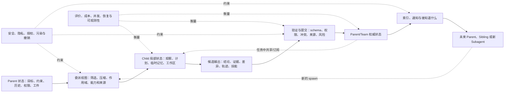

# Subagent Memory：从委派上下文到团队可依赖状态

**证据截止：2026-08-24｜当前版本：Round 02 广度扩展**

当 Parent Agent 把任务交给 Subagent 时，它面对的不是一个普通函数调用。Subagent 需要理解目标、约束、已经完成的工作、可用工具、项目状态和权限，但不应自动继承 Parent 的全部历史、秘密、攻击载荷和过期假设。Subagent 完成后，它返回的也不只是一段答案：观察、工件、失败、证据和技能可能影响 Parent 的后续行动，甚至成为其他 Agent 长期依赖的状态。

因此，Subagent Memory 的中心问题是两个方向相反、但相互约束的边界：

1. **继承边界：Parent → Child。** 在 spawn、handoff 或 agent-as-tool 调用时，怎样构造最小充分的状态视图？
2. **提交边界：Child → Parent/Team。** Child 产生的局部状态怎样被验证、合并、归因和晋升，才能成为团队可依赖的记忆？

这两个边界之间还有共享状态和并发问题。多个 Subagent 可能同时修改同一计划、事实、代码工件或世界模型；一个 Agent 的写入会变成另一个 Agent 的前提，并最终触发工具行动。于是“共享”本身不是解决方案，而是需要所有权、命名空间、提交纪律、来源、权限、检索和行动门控共同组成的控制面。

## 一张大图：Subagent Memory 的状态循环

这是一张描述性解剖图，不是推荐架构。有些系统只生成 handoff Markdown；有些让所有 Agent 读写同一文件或数据库；有些保留各 Agent 私有记忆，只共享索引或轨迹；更严格的系统会把 Child 的写入视为候选，经过验证和事务提交后才允许驱动行动。

## 八个主要机制分支

### 1. 上下文继承与委派边界

系统首先决定 Child 看见什么。最宽松的路线复制全部历史；更常见的工程路线是传递任务描述、结构化输入、过滤后的消息、workspace snapshot 或只读 memory mount。不同 orchestration 语义也不同：handoff 可能让 specialist 接管同一 run，agent-as-tool 则让 manager 保留控制并接收一个嵌套结果；共享应用状态与共享对话历史也不是同一件事。

最新安全研究把这个边界视为攻击传播面。[When Child Inherits](https://arxiv.org/abs/2605.08460)指出 Parent 的恶意指令、旧状态和资源控制可能随 spawn 传播。当前公开系统尚未形成统一的“最小充分委派包”协议。详见[继承与委派](mechanisms/01-context-inheritance.md)。

### 2. Subagent 局部持久化与身份

Spawn 时拿到什么，不等于 Subagent 下一次调用还记得什么。公开 runtime 已出现多种生命周期：LangChain supervisor-style Subagent 默认无状态；LangGraph subgraph 可以 per-invocation、per-thread 或 stateless；Claude Code 的命名 Subagent 可选择 `user`、`project` 或 `local` 持久记忆；OpenAI Sandbox Memory 以 layout 和 conversation identity 隔离，并允许内部 Subagent 只读而不生成新记忆。

这形成独立的工程问题：命名 Agent、一次调用、一个 thread、一个 project 和一个用户是否是同一个记忆主体？并行调用怎样避免 checkpoint namespace 冲突？实例销毁是否也清除其 memory files、summary、skills 和 derived index？详见[局部持久化与身份](mechanisms/08-local-persistence-and-identity.md)。

### 3. 所有权、命名空间与可见性

一条记忆可以属于 Agent 实例、任务、项目、团队、租户或整个 fleet。全局共享简单，却容易把用户偏好、项目秘密和局部推断变成所有 Agent 的无边界真相；完全私有又会让每个 Subagent 重复探索。

主要路线包括 per-agent 私有库、private/shared 双层状态、task/project namespace、role-based read/write contract、policy graph 和 transactive directory。[Collaborative Memory](https://arxiv.org/abs/2505.18279)把用户、Agent 与资源权限表示为动态关系；[Governed Shared Memory](https://arxiv.org/abs/2606.24535)则把 scoped retrieval、provenance 和 propagation policy 放入 fleet memory。详见[所有权与可见性](mechanisms/02-ownership-and-visibility.md)。

### 4. 共享协作底座

共享状态可以是黑板、文件、事件日志、结构化对象、知识图、MCP 服务或 pub/sub store。这里的关键不是后端品牌，而是权威对象和写入语义：Agent 是追加观察、修改当前值、提交 patch，还是发布只供其他 Agent 读取的工件？

Pilot 中的 GitHub 候选已经表现出多种形状：`memX` 以结构化状态和通知为中心，`octopus-blackboard` 使用 blackboard，`shared-agent-memory` 让多个 coding agent 指向同一项目存储，`Statewave` 则区分 append-only episode 与编译后的 active memory。详见[共享协作底座](mechanisms/03-shared-substrates.md)。

### 5. 同步、冲突与 belief commit

多个 Subagent 同时写入时，last-write-wins 只能给出确定结果，不能证明结果正确。更严格的路线会保留版本、来源和冲突集，或者把写入先放入 transaction，再由 schema、角色规则和 evidence gate 决定能否成为可行动信念。

[PatchBoard](https://arxiv.org/abs/2605.29313)使用 validated JSON Patch；[MemTX](https://arxiv.org/abs/2607.23929)区分 memory write 与 belief commit，并把撤销连接到 cascading repair；[LatticeMind](https://arxiv.org/abs/2608.08236)显式保存 incompatible claims。它们共同表明，前沿问题正在从“共享写入”转向“什么状态有资格成为行动前提”。详见[同步与提交](mechanisms/04-synchronization-and-commit.md)。

### 6. 回流、巩固与来源

Child 的最终文本通常压缩了大量中间证据。直接把摘要写入长期记忆会丢失观察与推断的区别，也会掩盖 dissent、失败条件和权限来源。主要路线包括结构化 result envelope、Parent adjudication、critic/curator、candidate-to-committed promotion 和 provenance-preserving synthesis。

[CoMIC](https://arxiv.org/abs/2606.00756)让 cloud critic 异步过滤完成轨迹，再汇总成跨 Agent 指导；[MAP-Graph](https://arxiv.org/abs/2608.10509)把 lineage 用于权限和行动风险，而不仅是审计。详见[回流与巩固](mechanisms/05-return-and-consolidation.md)。

### 7. 群体经验与技能迁移

Subagent Memory 不只保存事实，也可能保存 trajectory、strategy、反思和程序。[Multi-Agent Transactive Memory](https://arxiv.org/abs/2606.19911)让 producer 提交轨迹、consumer 检索复用；[DecentMem](https://arxiv.org/abs/2605.22721)让每个 Agent 保留独立 exploitation/exploration pool；[MemCollab](https://arxiv.org/abs/2603.23234)试图从不同模型轨迹中蒸馏共享约束，避免模型特有偏差直接迁移。

这里的核心不是“是否存成功案例”，而是适用条件、信用分配、版本、失败记录和多样性是否随经验一起保存。详见[经验与技能迁移](mechanisms/06-experience-and-skill-transfer.md)。

### 8. 发现、检索与行动耦合

即使团队已经保存了正确知识，新的 Subagent 仍需知道它存在。路线包括 pull search、subscription/inbox、who-knows-what directory、role-conditioned retrieval、path-trust reranking 和 token-bounded evidence packet。

普通 top-k 相关性不足以决定能否行动。共享内容还需要通过主体、任务、时间、权限、来源和风险过滤。[MAP-Graph](https://arxiv.org/abs/2608.10509)代表一种把检索、lineage trust 与 action gate 连接的路线。详见[发现与行动](mechanisms/07-retrieval-and-action.md)。

## 当前主流、最近变化与弱信号

广度语料和公开 runtime 文档支持一个保守判断：**当前工程主流仍是 Parent/manager 显式组织任务，Subagent 通过消息、工具结果、共享文件、checkpoint、应用状态或 scoped memory 交换上下文；完整的事务、动态权限、来源传播和可验证撤销并不普遍。** Shared store、blackboard、handoff file 和 per-thread/per-project persistence 已经有多种实现，但“可持久化”和“可共享”常停留在读写层，未必包含明确 belief commit 与跨 Agent 安全语义。

最近 12 个月的实质变化集中在四处：

- 从复制历史转向可过滤、可隔离的 delegation view；
- 从共享文本堆转向 typed state、patch、transaction、conflict set 与 lineage；
- 从单一共享库转向 private/shared、central/decentralized 和 population retrieval 等多种拓扑；
- 从 memory recall 评测转向多主体权限、删除、污染传播、并发和行动后果。

最近 90 天的弱信号更激进，包括 parent-child inheritance security、transactional belief commit、provenance-aware action gate、conflict lattice、transactive trajectory memory 和大量面向 coding-agent fleet 的新仓库。这些多数仍是预印本、项目自述或新建实现，不能仅因新或高星称为主流。详见[近期变化](trends.md)。

## 当前最重要的未知问题

- 怎样定义并测量“最小充分 delegation packet”，而不是只比较摘要长度？
- Child 本地状态、Parent 权威状态和团队共享状态之间是否需要统一 commit protocol？
- 当多个 Agent 的记忆来源互相依赖时，权限撤销和删除怎样沿 derivation graph 传播？
- 经验共享的收益究竟来自 Memory，还是更多 token、额外 critic、模型能力和任务重复？
- 公共 Benchmark 能否同时覆盖协作收益、隔离、并发、污染、恢复和行动后果？
- 现实 runtime 中的 shared context、session history、workspace、checkpoint 与 long-term memory 是否具有清晰一致的生命周期边界？

当前阶段已经给出第一版方案空间，但这些问题仍需要后续广度扩展、固定版本代码分析和协议对齐才能形成更强判断。
