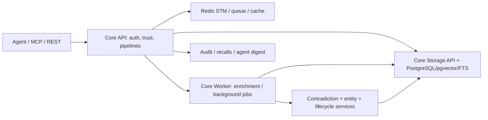

# Caura：多租户 Fleet Memory Control Plane 的 Write/Search/Contradiction Pipeline

**固定版本：** [`caura-ai/caura@54dd6d4`](https://github.com/caura-ai/caura/tree/54dd6d4f2075ca428b1f3a5a8c50114351ea4755)  
**观察：** 2026-08-24；release `plugin-v2.17.0`；Apache-2.0。未启动 Postgres/Redis或执行 tests。

## 结论

Caura不是简单 memory API，而是 API gateway + write/search pipeline + Postgres/pgvector/FTS + Redis/worker + identity/trust/audit/contradiction服务。它把 tenant/fleet/agent/visibility写入权威 row，并区分快速、强、STM和普通 persist路径。能力丰富也带来主要风险：同一语义散布在多个 route、write mode、background worker和 storage API，任何 path漏掉 scope或顺序都会造成能力漂移。

## 部署组件



Docker Compose固定 Postgres 16 + pgvector、Redis 7、core API/storage/worker等服务。数据库初始 schema的 `memories`含 tenant、fleet、agent、type、content、embedding、FTS、status、visibility、supersedes、timestamps；另有 entities/relations/agent/audit/fleet/document tables。

## 写入路径

[`write.py`](https://github.com/caura-ai/caura/blob/54dd6d4f2075ca428b1f3a5a8c50114351ea4755/core-api/src/core_api/pipeline/compositions/write.py)把责任顺序写成显式 pipeline：

### Strong mode

```text
length → tenant config → deterministic PII scan
→ business/personal pregate → hash
→ parallel embed + enrichment → merge
→ LLM governance decision
→ emit RDF triple → exact dedup → semantic dedup
→ persist row → schedule background tasks
```

### Fast mode

fast mode省掉 pre-persist LLM governance和 reject-style semantic dedup，改成 advisory near-duplicate metadata，然后写 row、异步补处理。它降低 write latency，也允许短时间 enrichment pending和重复候选。

### STM mode

只做 length、deterministic scan、resolve target、write ephemeral note，不运行完整 enrichment。不同 mode并非同一安全/一致性保证。

## 搜索路径

[`search.py`](https://github.com/caura-ai/caura/blob/54dd6d4f2075ca428b1f3a5a8c50114351ea4755/core-api/src/core_api/pipeline/compositions/search.py)执行 profile → temporal hint → query class → parallel embedding/entity boost → scored search → rerank → post-filter → serialize → STM injection → recall tracking/audit。

REST `agent_id`既可能是 visibility identity，也有独立 `written_by` author filter；显式 scope支持 `agent/fleet/all` trust ladder。当前代码优先使用 authenticated agent identity，避免 query param伪装 peer；agent scope、fleet enforcement和 cross-tenant widen有多处分支与 audit。

## Contradiction 与 lifecycle

write后 background detector通过 entity/RDF overlap或其他 trigger寻找候选，记录 conflict、status和 `supersedes_id`；storage batch status update提供 expected supersedes CAS。当前仓库有大量 contradiction、dedup、retraction、scope、hard purge和 concurrency tests。

论文报告的 pipeline-ordering问题与代码结构一致：strong semantic duplicate可能在 contradiction detector前拒绝 row；fast mode已改为 advisory near-dup，说明 write mode直接改变“新矛盾是否进入后置 resolver”。

## 身份、治理与安全

memory row绑定 tenant/fleet/agent/visibility；agent credential有 trust level和 home fleet。PII deterministic scan在 hash前执行，使 redacted content成为 dedup对象；LLM governance只在相应持久化分支运行。Keystone policy、agent digest、lifecycle audit、recall logging和 cross-tenant audit形成控制面。

first-party README中的生产客户/规模/延迟是维护者声明，本报告不把它当独立采用证据。固定代码证明组件和测试存在，不证明线上配置、所有 handler或实际隔离率。

## 维护、测试与失败模式

观察日同日有 commit和 release，测试覆盖面很大。没有运行多服务 stack，因此 setup为 documented、tests/CI为 present。

项目特有失败：write mode保证不同；enrichment/embedding pending会产生暂时能力缺失；身份与scope逻辑跨 route/storage/MCP；tenant key按设计比 agent key更宽；background contradiction/cleanup有延迟；dedup与resolver顺序交互；hard purge必须跨大量 tenant table；provider配置/embedding维度会让搜索退化。反转需要独立运行同版本、多租户、多 handler和 crash/retry fault campaign。
