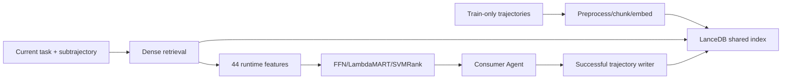

# MATM：Population Trajectory Index 与 Consumer-specific LTR

**固定版本：** [`kimdanny/matm@2fb906b`](https://github.com/kimdanny/matm/tree/2fb906b1a572f9ced0177741dee44be70ef1223c)  
**观察：** 2026-08-24；无 release；Apache-2.0。未重跑 ALFWorld/WebArena。

## 结论

这是与论文高度对齐的研究 artifact：LanceDB保存 state-conditioned trajectory chunks，consumer按当前 task/subtrajectory检索，optional LTR用44个 runtime/query/source/consumer features重排，成功 runtime trajectory可在线追加。它是population experience retrieval，不是通用 agent message/state store；没有主体权限、conflict、删除、provenance policy或安全 admission。

## 组件关系

## Index 与 Retrieval

preprocess scripts建立官方/test split、验证无 test leakage、生成 train-only LanceDB。trajectory chunk保存 state/goal/context/step/source model等。`LanceDBClient.search`产生候选；retrieval strategy决定每步、指定 step或观察相似时检索。

`ltr/runtime_features.py`组合 embedding similarity、retrieved rank、trajectory length、step distance、source/consumer model identity与能力特征等；预训练 FFN、LambdaMART、SVMRank模型随仓库发布。Reranker orchestrator选择最终 chunk并注入 Agent prompt。

## Online population update

环境变量 `ONLINE_MEMORY_ENABLED=1`启用 successful trajectory writer。ALFWorld/WebArena runner完成 episode后将 runtime trajectory提交到共享 index并 refresh retriever。任何 Agent可既 producer又 consumer，但代码可见的 admission主要是 task success与schema；没有 Agent trust、重复语义、恶意轨迹或工具版本失效检查。

## 数据、依赖与复现边界

依赖 LanceDB、embedding model、ALFWorld/WebArena环境、Playwright、多个 ranker（XGBoost/PyTorch/SVMRank）与外部 trajectory datasets。仓库包含 split、leakage verification、no-retrieval runs、预训练rankers和evaluation scripts；这比只给 README强。

论文/README报告34 consumer models的平均结果，ALFWorld收益大于WebArena；本次未执行，数字保持author-reported。WebArena需要独立部署和host配置，完整复现成本高。

## 项目特有失败模式

- 同一 task type跨 train/test仍可能相似；
- index只保留检索对象，不处理来源权限或revoke；
- online append在多 producer下的 transaction/dedup未形成治理协议；
- consumer-specific ranker会随新模型/工具漂移；
- trajectory可能含过期action、secret或错误side effect；
- runner在“要求检索但无 candidate”时可直接skip episode，影响评测 denominator解释。

反转需要独立重跑固定 split和模型、审计 online concurrent write，并加入 malicious/stale producer与permission实验。
