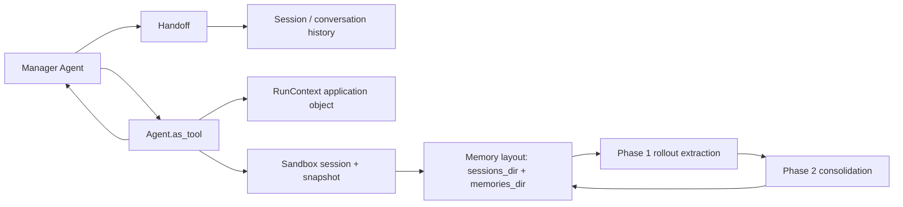

# OpenAI Agents SDK：Handoff、Agent-as-Tool 与 Sandbox Memory 的三种状态边界

**固定版本：** [`openai/openai-agents-python@2334679`](https://github.com/openai/openai-agents-python/tree/233467994fac7e7dbd868931573cc9a4302c0a16)  
**观察：** 2026-08-24；release `v0.22.0`；MIT。未执行 SDK，只检查代码、测试、文档和 manifest。

## 结论

该 SDK 没有一个统一的“Subagent Memory”开关，而是暴露三组不同机制：Handoff 传递/过滤同一运行历史；`Agent.as_tool()` 用模型生成或结构化 input 启动嵌套 Agent，manager 保留控制；Sandbox Memory 把跨 run 经验写入 workspace files。Application context、conversation Session、sandbox snapshot 和 memory layout 是四种不同状态，使用者必须自行决定它们是否共享。

## 组件关系



## Parent → Child

### Handoff

[`HandoffInputData`](https://github.com/openai/openai-agents-python/blob/233467994fac7e7dbd868931573cc9a4302c0a16/src/agents/handoffs/__init__.py#L71)分开 `input_history`、`pre_handoff_items`、`new_items` 和可选 `input_items`。默认接收完整历史；`input_filter` 可以让 next Agent 使用 `input_items`，同时 `new_items` 仍保留在 Session history。这意味着“Child 看不到”与“历史不保存”是两个决定。server-managed conversation 不支持该 filter/nested-history能力，代码文档直接标注这一限制。

### Agent as tool

[`Agent.as_tool()`](https://github.com/openai/openai-agents-python/blob/233467994fac7e7dbd868931573cc9a4302c0a16/src/agents/agent.py#L583)明确区别于 Handoff：Child 获得 generated/structured input，不接管 conversation，manager 在 tool result 后继续。参数可由 dataclass/Pydantic 生成 strict JSON schema；`input_builder` 决定怎样编译嵌套 input。

嵌套运行会创建 fresh `ToolContext` 以避免直接共享 Parent approval state，但复用同一个 application `context` 对象和 usage 计数，并可传入独立 `session`、`conversation_id` 或 sandbox `run_config`。因此模型消息隔离不表示应用依赖或 workspace 自动隔离。

## Child → Parent

默认只取嵌套 Agent 的最后输出，也可用 `custom_output_extractor`；structured parameters 和 tool input 可记录在 nested context。Manager 接收的是一个 tool result，不会自动获得 Child 全部中间消息。若需要证据、unknowns 或 artifact，必须由 input/output schema 或共享 workspace 约定。

## Sandbox Memory

[`Memory` capability](https://github.com/openai/openai-agents-python/blob/233467994fac7e7dbd868931573cc9a4302c0a16/src/agents/sandbox/capabilities/memory.py#L18)将 `read` 和 `generate` 分开，可构造 read-only internal/subagent。读取时从 `memory_summary.md` 注入最多 15,000 tokens，并要求 Shell 以便按需打开详细文件；live update 还要求 Filesystem。

Memory identity 不是 agent name，而是 `MemoryLayoutConfig` 的 `memories_dir` 与 `sessions_dir`。[`SandboxMemoryGenerationManager`](https://github.com/openai/openai-agents-python/blob/233467994fac7e7dbd868931573cc9a4302c0a16/src/agents/sandbox/memory/manager.py#L43)在 sandbox session 内按 layout 复用：相同 layout 共享 generation manager，不同 layout 隔离；只重叠其中一个目录会直接报错，防止共享一半状态。

生成链路是：

```text
run segment
→ per-rollout JSONL under sessions_dir
→ Phase 1: raw memory + rollout summary
→ pre-stop flush
→ Phase 2 SandboxAgent (same sandbox session, max_turns=500)
→ MEMORY.md / memory_summary.md and selection artifacts
```

worker 单个 rollout 失败会记录错误并继续；Phase 2 失败不会清空 pending selection。Memory artifacts 只有在复用 sandbox session/state/snapshot 或外部保存目录时才能进入未来 run。

## 依赖与集成边界

- orchestration：Agents SDK `Runner`、Handoff、FunctionTool；
- state：client-managed Session、OpenAI server conversation、application context；
- sandbox：local/remote provider、manifest、filesystem/shell；
- memory：workspace files + background model calls；
- approval：nested resume/interrupt 有单独记录，不等同于 Parent approval继承。

## 测试、维护与未知项

仓库有 Handoff history duplication、Agent-as-tool、Session、sandbox isolation 和 memory tests，并在观察日前四天发布 `v0.22.0`。代码可见的是 API 与测试存在，不证明所有 provider 的 production durability。

项目特有风险包括：application context 是共享可变对象；Handoff filter 与 server-managed state 的能力不一致；layout key 配错会共享不应共享的记忆；Phase 2 consolidation Agent 与 task Agent共享 sandbox resource；15k startup summary可能本身很大；read-only 与 live-update需要显式配置。反转本分析需要固定版本测试证明这些边界在 provider adapter 中被进一步隔离或统一。
