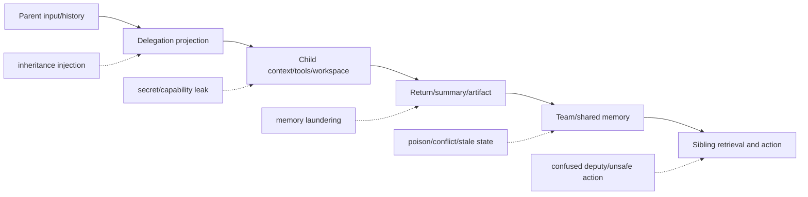

# 安全、权限与治理：风险沿状态链传播

Subagent Memory 的主要安全链不是单点数据库攻击，而是输入经继承、局部处理、摘要/回流、共享检索和行动逐段改变形态；只审最终答案会漏掉内部消息、压缩状态和持久文件通道。

## 五段攻击面

### 1. 继承

Full-history fork、普通 custom state copy、共享 application context 和共享 workspace 是不同通道。When Child Inherits 把 unrestricted inheritance、resource access、async divergence 与 cross-agent termination 分成独立漏洞类；Codex、OpenAI Agents SDK 和 Deep Agents 的固定代码也显示，过滤消息不自动过滤 filesystem、application object、tools 或普通 state。

### 2. Child 局部执行

短生命周期能减少长期污染，却不等于隔离。Child 仍可能获得凭证、网络、shell、共享 backend 或 Parent 的普通 state。AGENTSYS 的方案是让 raw tool output 留在短命 worker，只允许通过 typed validator 的结构化回传进入 Parent；这是上下文隔离与能力 gate 的组合，不是摘要器。

### 3. 回流与压缩

State Contamination 的 memory laundering 说明，原始恶意文本在摘要后可能变得 classifier-clean，却保留行为影响。只在完成摘要后做过滤，可能错过在压缩过程中形成的隐蔽状态；sanitization 应在摘要前后和 commit 前分别观察。

### 4. Shared memory

MPBench 区分显式指令、system policy、compaction 与 experience-to-procedure 四种写入 authority；Bad Memory 则从恶意 payload 已存在于 workspace memory 开始。两者不能给统一攻击率，却覆盖“怎样写入”和“写入后怎样跨 session 生效”的两端。

直接共享还会产生 scope 与 conflict 风险。Caura 把 tenant/fleet/agent/visibility 写进 row，并在多个 route/storage/worker 处理；Collaborative Memory 用 policy graph 做 read/write projection；普通 Redis key 或 shared file 则没有同等语义。

### 5. 检索与行动

AgentLeak 显示内部 inter-agent message 的泄漏可能高于 final output；MAP-Graph 进一步把 permission、path trust、affected-state 和 action risk 接起来。相关内容并不自动具有当前主体授权，过去可执行的命令也不自动适用于当前工具、版本和 side effect。

## 控制面应该回答什么

| 边界 | 必须回答的问题 | 不能替代它的东西 |
|---|---|---|
| Spawn | 哪些字段、文件、工具、凭证和 memory scope 可见？ | 只有自然语言 system prompt |
| Write | 谁以什么 authority 写入观察、推断、技能或当前值？ | JSON Schema 只验证形状 |
| Commit | 哪些证据、版本、冲突和 reviewer 允许晋升？ | last-write-wins 只选择 winner |
| Read | 当前 Agent/任务/用户能否读取、以什么投影读取？ | 向量相似度 |
| Action | 召回内容能否在当前权限下触发副作用？ | 内容“可信分” |
| Revoke | 删除/撤权怎样传播到摘要、图、缓存、技能和消费者？ | 从一个表删 row |

## 当前比较可靠的设计原则

- 消息、state、workspace、credentials、tools 和 persistent memory 分别授权；
- Child output 先作为候选，保留 Agent/task/tool/time/source 与适用条件；
- 冲突不要过早折叠为单一摘要，高风险行动允许 abstain；
- 召回时重新检查当前主体、scope、版本、冲突和风险；
- 删除区分停止召回、逻辑 tombstone、物理擦除、派生修复和 side-effect compensation；
- audit 记录内部 channel，不只记录最终回答。

## 仍未解决

动态权限在派生摘要、embedding、graph edge、skill 和模型内化之间怎样级联，仍缺跨系统证据。Parent 单写者可以降低并发，却可能成为 confused deputy；中心治理服务更明确，也引入更多 path 和配置漂移。最关键的空白是一个跨真实 runtime 的端到端攻击/撤销实验，而不是再给某个过滤器单点 ASR。
